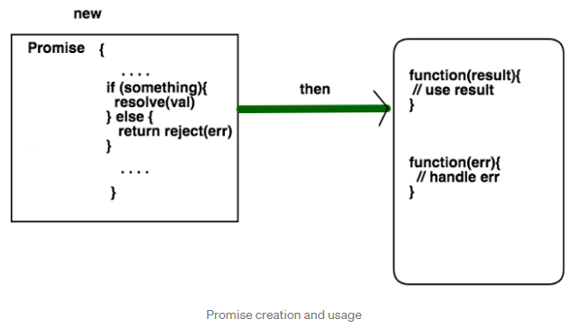
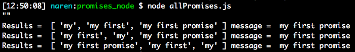

# Writing neat asynchronous Node JS code with Promises

## Table of Contents
- [What is a Promise?](#what-is-a-promise)
- [Pain of writing asynchronous code in Node JS](#pain-of-writing-asynchronous-code-in-node-js)
- [Creating a Promise](#creating-a-promise)
- [Making a sequence of Promises](#making-a-sequence-of-promises)
- [References](#references)

Have you ever wondered how JavaScript is asynchronous? In this rapid world, complex apps are getting created every day. To manage that complexity, one need good tools to define and modify the code. Promises are such constructs which are introduced to reduce the complexity of Asynchronous JavaScript code. You need to write async code every now and then to load data into your tables of UI, make requests to the server, load DOM elements on priority, write non-blocking code on Node etc.

Note: I also wrote a programming book. If you are a full stack software developer by chance, please do check it out.

> **Building RESTful Web services with Go**
>
> [Explore the necessary concepts of REST API development by building few real world services from scratch.Key…](https://www.amazon.com/Building-RESTful-Web-services-Go/dp/1788294289)
>
> 
>

## What is a Promise?
According to the official website:

A `Promise` is a proxy for a value not necessarily known when the promise is created. It allows you to associate handlers to an asynchronous action's eventual success value or failure reason. This lets asynchronous methods return values like synchronous methods: instead of the final value, the asynchronous method returns a _promise_ for the value at some point in the future.

In simple words “A promise is a word taken for some action, the other party who gave the promise might fulfill it or deny it”. In the case of fulfilling, the promise gets resolved, and in another case, it gets rejected.

We can create a promise in JavaScript and use it as an upcoming fact to describe few actions. Promises are kind of design patterns to remove the usage of unintuitive callbacks.



As the picture depicts, these are the steps for creating and using promises
* A promise can be created in our JavaScript code. Or else it can be returned from an external node package
* Any promise that performs async operations should call any one of the two methods **resolve** or **reject**. The code logic should take care of when and where to call these functions. If the operation is successful, pass that data to the code that uses that promise, otherwise pass error
* The code which uses a promise should call **then** function on that promise. It takes two anonymous functions as parameters. The first function executes if the promise is resolved and the second function executes if promise is rejected.

What happens if you try to access the value from promise before it is resolved or rejected. Then promise will be in the **pending** state.

**[⬆ back to top](#table-of-contents)**

## Pain of writing asynchronous code in Node JS
All Node JS developers agree upon one point. Node development is quite different from other programming languages like Python or Ruby. In Python, you write code in a straight way with expected behavior. But in Node because of asynchronous factors, the code might freak you out with unexpected behavior. Variables you define and assign will not have values at the point where you need it. The scope is a bit tricky. If there is a lot of I/O in your applications God knows what can happen. Basically, Node is not sequential. A different mindset is needed while developing applications on Node platform. 
One of my friends **Surya** newly started writing few applications using AWS Node SDK. He was irritated a lot and almost gave up because of the uncertainty of code by comparing that to his previous ANSI C coding experience.

In this article, I will show how we can use Promises in Node JS to bring certainty to our code when there is a lot of I/O(HTTP requests) performed.

**[⬆ back to top](#table-of-contents)**

## Creating a Promise
We can create a promise in our Node JS program using the **new** constructor. For all the examples I use **Node v6.5.0**. You should install Node JS on your machine before beginning with this tutorial. Even though promises can be used in browsers, this article mainly focuses on writing asynchronous code on Node.

```JavaScript
var myPromise = new Promise(function(resolve, reject){
   ....
})
```

So myPromise is a Promise type object which allows us to use it for later.

Everyone knows about the Github API. If not, it is a REST API by provided by Github to fetch the details about **Users, Repositories** etc

Let us take one API out of their collection. It is users API. Something like this

```
https://api.github.com/users/narenaryan
```

If you make an HTTP GET request for this URL, you will be returned a JSON with all stats about myself like repos, followers, following, stars etc.

For making an HTTP request from our Node app, let us install a small package which make things clear.

```bash
sudo npm install request -g
```

request package removes the boilerplate code of inbuilt **http** package.

I am going to use this as an example for our node application. Suppose we have a global variable called **userDetails** in our code and we thought to initialize it. It needs to fetch details of a Github user from Github and load that variable. Then with promises we can do this.

```Javascript
var userDetails;

function initialize() {
    // Setting URL and headers for request
    var options = {
        url: 'https://api.github.com/users/narenaryan',
        headers: {
            'User-Agent': 'request'
        }
    };
    // Return new promise 
    return new Promise(function(resolve, reject) {
     // Do async job
        request.get(options, function(err, resp, body) {
            if (err) {
                reject(err);
            } else {
                resolve(JSON.parse(body));
            }
        })
    })
}
```

Where are you initializing declared userData variable above? **initialize** function is returning a promise instead of setting data or returning data. We need to take that promise and handle it in such a way that we can fill the variable and proceed our program from there.

* **options** object is used to set URL and Headers for request
* **request.get** makes a GET request to the Github API
* **body** consists of the JSON response from the server
* We are calling resolve method to pass data back to the handler which implements **then** on the promise.

Now let us create a **main** function where we get the Promise for above function and attach a function callback in the **then** function.

```JavaScript
var request = require("request");
var userDetails;

function initialize() {
    // Setting URL and headers for request
    var options = {
        url: 'https://api.github.com/users/narenaryan',
        headers: {
            'User-Agent': 'request'
        }
    };
    // Return new promise 
    return new Promise(function(resolve, reject) {
    	// Do async job
        request.get(options, function(err, resp, body) {
            if (err) {
                reject(err);
            } else {
                resolve(JSON.parse(body));
            }
        })
    })

}

function main() {
    var initializePromise = initialize();
    initializePromise.then(function(result) {
        userDetails = result;
        console.log("Initialized user details");
        // Use user details from here
        console.log(userDetails)
    }, function(err) {
        console.log(err);
    })
}

main();
```

Output looks like this.

```
Initialized user details
{
 "login": "narenaryan",
 "id": 5425726,
 "avatar_url": "https://avatars3.githubusercontent.com/u/5425726?v=3",
 "gravatar_id": "",
 "url": "https://api.github.com/users/narenaryan",
 "html_url": "https://github.com/narenaryan",
 "followers_url": "https://api.github.com/users/narenaryan/followers",
 "following_url": "https://api.github.com/users/narenaryan/following{/other_user}",
 "gists_url": "https://api.github.com/users/narenaryan/gists{/gist_id}",
 "starred_url": "https://api.github.com/users/narenaryan/starred{/owner}{/repo}",
 "subscriptions_url": "https://api.github.com/users/narenaryan/subscriptions",
 "organizations_url": "https://api.github.com/users/narenaryan/orgs",
 "repos_url": "https://api.github.com/users/narenaryan/repos",
 "events_url": "https://api.github.com/users/narenaryan/events{/privacy}",
 "received_events_url": "https://api.github.com/users/narenaryan/received_events",
 "type": "User",
 "site_admin": false,
 "name": "Naren Arya",
 "company": "Citrix R&D India",
 "blog": "http://narenarya.in",
 "location": "Banglaore",
 "email": null,
 "hireable": true,
 "bio": "A Software Development Engineer with expertise in Python and JavaScript. Coding in Golang and Reading books are his hobbies .",
 "public_repos": 69,
 "public_gists": 41,
 "followers": 134,
 "following": 7,
 "created_at": "2013-09-10T09:01:57Z",
 "updated_at": "2017-04-24T04:39:04Z"
}
```

Suppose you want to perform an operation after a promise is fulfilled use another then method to transform the data you obtained from the promise.

I need to return gists + repos count of **narenaryan** on github. Then I can simply add one more **then** like this
```JavaScript
function main() {
    var initializePromise = initialize();
    initializePromise.then(function(result) {
        userDetails = result;
        console.log("Initialized user details");
        // Use user details from here
        return userDetails;
    }, function(err) {
        console.log(err);
    }).then(function(result) {
        // Print the code activity. Prints 110
        console.log(result.public_gists + result.public_repos);
    })
}
```

By chaining **then** functions on a promise we can pass the data to the next functions. If you are writing logic by initializing data and then using it in multiple functions, above example can help you. The above design is good but not great.

We can also queue the asynchronous actions using Promises. Something similar to singleton pattern can be achieved using them.

When a value is returned from **then**, the next **then** can get the value. We can also return a promise from then so that the next chained **then** function can use that to build its own logic.

```JavaScript
var request = require("request");
var userDetails;

function getData(url) {
    // Setting URL and headers for request
    var options = {
        url: url,
        headers: {
            'User-Agent': 'request'
        }
    };
    // Return new promise 
    return new Promise(function(resolve, reject) {
        // Do async job
        request.get(options, function(err, resp, body) {
            if (err) {
                reject(err);
            } else {
                resolve(body);
            }
        })
    })
}

var errHandler = function(err) {
    console.log(err);
}

function main() {
    var userProfileURL = "https://api.github.com/users/narenaryan";
    var dataPromise = getData(userProfileURL);
    // Get user details after that get followers from URL
    dataPromise.then(JSON.parse, errHandler)
               .then(function(result) {
                    userDetails = result;
                    // Do one more async operation here
                    var anotherPromise = getData(userDetails.followers_url).then(JSON.parse);
                    return anotherPromise;
                }, errHandler)
                .then(function(data) {
                    console.log(data)
                }, errHandler);
}


main();
```

The output is the list of details of my Github followers.
```
[ { login: 'kmvkrish',
    id: 10069490,
    avatar_url: 'https://avatars2.githubusercontent.com/u/10069490?v=3',
    gravatar_id: '',
    url: 'https://api.github.com/users/kmvkrish',
    html_url: 'https://github.com/kmvkrish',
..........
......
}]
```

If you observe above we are returning anotherPromise, but in next **then** we are using data as normal data. The above code is making two HTTP requests to the Github API but finally receiving the correct data and printing it to the console.

**[⬆ back to top](#table-of-contents)**

## Making a sequence of Promises
We can make a sequence of promises for doing things in a particular order. We can use **Promise.all** function which takes a list of promises in the given order and returns another promise which we can use a **then** method to conclude the logic.

Let us write a sample program using **Promise.all**. We are writing it in ES6 style.

```JavaScript
var message = "";

promise1 = new Promise((resolve, reject) => {
    setTimeout(() => {
        message += "my";
        resolve(message);
    }, 2000)
})

promise2 = new Promise((resolve, reject) => {
    setTimeout(() => {
        message += " first";
        resolve(message);
    }, 2000)
})

promise3 = new Promise((resolve, reject) => {
    setTimeout(() => {
        message += " promise";
        resolve(message);
    }, 2000)
})

var printResult = (results) => {console.log("Results = ", results, "message = ", message)}

function main() {
    // See the order of promises. Final result will be according to it
    Promise.all([promise1, promise2, promise3]).then(printResult);
    Promise.all([promise2, promise1, promise3]).then(printResult);
    Promise.all([promise3, promise2, promise1]).then(printResult);
    console.log("\"\"" + message);
}

main();
```

**setTimeout** is used to simulate a blocking async operation. We are creating three promises and appending a string to the original variable called **message**. We should use **Promise.all** when we don’t care about the order of execution but finally message should be filled with the expected content.

The output for above program looks like



**results** are the result of each promise in the list. That data is passing to **printResult** function here.

The output clearly tells the final message is getting updated properly irrespective of order.

> Note: ___Promise.all___ fails if any one of the Promise got rejected. It is an ___and___ operation between promise fulfillments
>

Now see this statement from the code

```JavaScript
console.log("\"\"" + message);
```

Even though this statement is below the Promises, it printed first in the output. Reason is this code will be executed in a non-blocked way. If you are expecting the value to be modified, then implement logic in the **then** function not outside.

Amazon Node SDK is providing the support for promises. They will return you the promise instead of result so you can write your async code on top of their API.

**[⬆ back to top](#table-of-contents)**

## References:

If you are looking for advanced usage of Promises, then make sure you go through these wonderful guides below.

> **JavaScript Promises: an Introduction | Web | Google Developers**
>
> [This throws together a lot of new ES6 stuff: promises, generators, let, for-of. When we yield a promise, the spawn...](https://developers.google.com/web/fundamentals/getting-started/primers/promises)
>
> 
>

> **Promise**
>
> [Promise - A Promise object represents a value that may not be available yet](https://developer.mozilla.org/en-US/docs/Mozilla/JavaScript_code_modules/Promise.jsm/Promise)
>
> 
>

> **Promise.all**
>
> [The Promise.all() method returns a single Promise that resolves when all of the promises in the iterable argument have...](https://developer.mozilla.org/en/docs/Web/JavaScript/Reference/Global_Objects/Promise/all)
>
> 
>

> **Support for Promises in the SDK | AWS Developer Blog**
>
> [aws.amazon.com](https://aws.amazon.com/blogs/developer/support-for-promises-in-the-sdk/)
>

> **Using JavaScript Promises - AWS SDK for JavaScript**
>
> [docs.aws.amazon.com - Use JavaScript promises for asynchronous calls with the SDK for JavaScript.](http://docs.aws.amazon.com/sdk-for-javascript/v2/developer-guide/using-promises.html)
>

**[⬆ back to top](#table-of-contents)**
