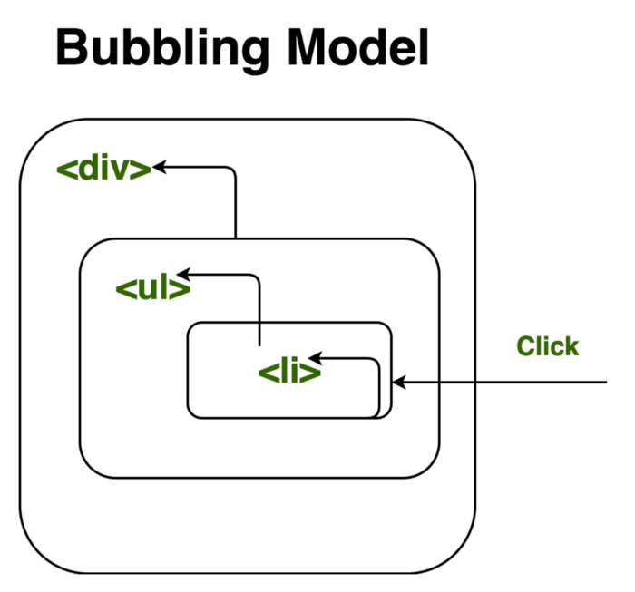

# Table of Contents

- [HTML](#html)
- [HTML-Absolutely Must Know As A Developer](#html-absolutely-must-know-as-a-developer)
- [CSS](#css)
- [CSS-Absolutely Must Know As A Developer](#css-absolutely-must-know-as-a-developer)
- [JavaScript](#javascript)
- [JavaScript-Absolutely Must Know As A Developer](#javascript-absolutely-must-know-as-a-developer)

# HTML

# HTML-Absolutely Must Know As A Developer

# CSS

# CSS-Absolutely Must Know As A Developer

# JavaScript

## Table of Contents

- [Modern JavaScript cheatsheet](#modern-javascript-cheatsheet)
  * [Introduction](#introduction)
    + [Motivation](#motivation)
    + [Complementary resources](#complementary-resources)
  * [Table of contents](#table-of-contents)
  * [Notions](#notions)
    + [Variable declaration: var, const, let](#variable-declaration-var-const-let)
      - [Short explanation](#short-explanation)
      - [Sample code](#sample-code)
      - [Detailed explanation](#detailed-explanation)
      - [External resource](#external-resource)
    + [Arrow function](#-arrow-function)
      - [Sample code](#sample-code-1)
      - [Detailed explanation](#detailed-explanation-1)
        * [Concision](#concision)
        * [*this* reference](#this-reference)
      - [Useful resources](#useful-resources)
    + [Function default parameter value](#function-default-parameter-value)
      - [External resource](#external-resource-1)
    + [Destructuring objects and arrays](#destructuring-objects-and-arrays)
      - [Explanation with sample code](#explanation-with-sample-code)
      - [Useful resources](#useful-resources-1)
    + [Array methods - map / filter / reduce](#array-methods---map--filter--reduce)
      - [Sample code](#sample-code-2)
      - [Explanation](#explanation)
        * [Array.prototype.map()](#arrayprototypemap)
        * [Array.prototype.filter()](#arrayprototypefilter)
        * [Array.prototype.reduce()](#arrayprototypereduce)
        * [Array.prototype.find()](#arrayprototypefind)
      - [External Resource](#external-resource-2)
    + [Spread operator "..."](#spread-operator-)
      - [Sample code](#sample-code-3)
      - [Explanation](#explanation-1)
        * [In iterables (like arrays)](#in-iterables-like-arrays)
        * [Function rest parameter](#function-rest-parameter)
        * [Object properties spreading](#object-properties-spreading)
      - [External resources](#external-resources)
    + [Object property shorthand](#object-property-shorthand)
      - [Explanation](#explanation-2)
      - [External resources](#external-resources-1)
    + [Promises](#promises)
      - [Sample code](#sample-code-4)
      - [Explanation](#explanation-3)
        * [Create the promise](#create-the-promise)
        * [Promise handlers usage](#promise-handlers-usage)
      - [External Resources](#external-resources-2)
    + [Template literals](#template-literals)
      - [Sample code](#sample-code-5)
      - [External resources](#external-resources-3)
    + [Tagged Template Literals](#tagged-template-literals)
      - [External resources](#external-resources-4)
    + [Imports / Exports](#imports--exports)
      - [Explanation with sample code](#explanation-with-sample-code-1)
        * [Named exports](#named-exports)
        * [Default import / export](#default-import--export)
      - [External resources](#external-resources-5)
    + [JavaScript *this*](#-javascript-this)
      - [External resources](#external-resources-6)
    + [Class](#class)
      - [Samples](#samples)
      - [External resources](#external-resources-7)
    + [Extends and super keywords](#extends-and-super-keywords)
      - [Sample Code](#sample-code-6)
      - [External Resources](#external-resources-8)
    + [Async Await](#async-await)
      - [Sample code](#sample-code-7)
      - [Explanation with sample code](#explanation-with-sample-code-2)
      - [Error handling](#error-handling)
      - [External resources](#external-resources-9)
    + [Truthy / Falsy](#truthy--falsy)
      - [External resources](#external-resources-10)
    + [Anamorphisms / Catamporphisms](#anamorphisms-and-catamorphisms)
      - [Anamorphisms](#anamorphisms)
      - [Catamorphisms](#catamorphisms)
      - [External resources](#external-resources-11)
    + [Generators](#generators)
      - [External resources](#external-resources-12)
    + [Static Methods](#static-methods)
      - [Short Explanation](#short-explanation-1)
      - [Sample Code](#sample-code-8)
      - [Detailed Explanation](#detailed-explanation-2)
        * [Calling other static methods from a static method](#calling-other-static-methods-from-a-static-method)
        * [Calling static methods from non-static methods](#calling-static-methods-from-non-static-methods)
      - [External resources](#external-resources-13)
  * [Glossary](#glossary)
    + [Scope](#-scope)
    + [Variable mutation](#-variable-mutation)

## Notions

### Variable declaration: var, const, let

In JavaScript, there are three keywords available to declare a variable, and each has its differences. Those are ```var```, ```let``` and ```const```.

#### Short explanation

Variables declared with ```const``` keyword can't be reassigned, while ```let``` and ```var``` can.

I recommend always declaring your variables with ```const``` by default, but with ```let``` if it is a variable that you need to *mutate* or reassign later.

<table>
  <tr>
    <th></th>
    <th>Scope</th>
    <th>Reassignable</th>
    <th>Mutable</th>
   <th><a href="#tdz_sample">Temporal Dead Zone</a></th>
  </tr>
  <tr>
    <th>const</th>
    <td>Block</td>
    <td>No</td>
    <td><a href="#const_mutable_sample">Yes</a></td>
    <td>Yes</td>
  </tr>
  <tr>
    <th>let</th>
    <td>Block</td>
    <td>Yes</td>
    <td>Yes</td>
    <td>Yes</td>
  </tr>
   <tr>
    <th>var</th>
    <td>Function</td>
    <td>Yes</td>
    <td>Yes</td>
    <td>No</td>
  </tr>
</table>

#### Sample code

```javascript
const person = "Nick";
person = "John" // Will raise an error, person can't be reassigned
```

```javascript
let person = "Nick";
person = "John";
console.log(person) // "John", reassignment is allowed with let
```

#### Detailed explanation

The [*scope*](#scope_def) of a variable roughly means "where is this variable available in the code".

##### var

```var``` declared variables are *function scoped*, meaning that when a variable is created in a function, everything in that function can access that variable. Besides, a *function scoped* variable created in a function can't be accessed outside this function.

I recommend you to picture it as if an *X scoped* variable meant that this variable was a property of X.

```javascript
function myFunction() {
  var myVar = "Nick";
  console.log(myVar); // "Nick" - myVar is accessible inside the function
}
console.log(myVar); // Throws a ReferenceError, myVar is not accessible outside the function.
```

Still focusing on the variable scope, here is a more subtle example:

```javascript
function myFunction() {
  var myVar = "Nick";
  if (true) {
    var myVar = "John";
    console.log(myVar); // "John"
    // actually, myVar being function scoped, we just erased the previous myVar value "Nick" for "John"
  }
  console.log(myVar); // "John" - see how the instructions in the if block affected this value
}
console.log(myVar); // Throws a ReferenceError, myVar is not accessible outside the function.
```

Besides, *var* declared variables are moved to the top of the scope at execution. This is what we call [var hoisting](https://developer.mozilla.org/en-US/docs/Web/JavaScript/Reference/Statements/var#var_hoisting).

This portion of code:

```js
console.log(myVar) // undefined -- no error raised
var myVar = 2;
```

is understood at execution like:

```js
var myVar;
console.log(myVar) // undefined -- no error raised
myVar = 2;
```

##### let

```var``` and ```let ``` are about the same, but ```let``` declared variables

- are *block scoped*
- are **not** accessible before they are assigned
- can't be re-declared in the same scope

Let's see the impact of block-scoping taking our previous example:

```javascript
function myFunction() {
  let myVar = "Nick";
  if (true) {
    let myVar = "John";
    console.log(myVar); // "John"
    // actually, myVar being block scoped, we just created a new variable myVar.
    // this variable is not accessible outside this block and totally independent
    // from the first myVar created !
  }
  console.log(myVar); // "Nick", see how the instructions in the if block DID NOT affect this value
}
console.log(myVar); // Throws a ReferenceError, myVar is not accessible outside the function.
```

<a name="tdz_sample"></a> Now, what it means for *let* (and *const*) variables for not being accessible before being assigned:

```js
console.log(myVar) // raises a ReferenceError !
let myVar = 2;
```

By contrast with *var* variables, if you try to read or write on a *let* or *const* variable before they are assigned an error will be raised. This phenomenon is often called [*Temporal dead zone*](https://developer.mozilla.org/en-US/docs/Web/JavaScript/Reference/Statements/let#Temporal_Dead_Zone_and_errors_with_let) or *TDZ*.

> **Note:** Technically, *let* and *const* variables declarations are being hoisted too, but not their assignation. Since they're made so that they can't be used before assignation, it intuitively feels like there is no hoisting, but there is. Find out more on this [very detailed explanation here](http://jsrocks.org/2015/01/temporal-dead-zone-tdz-demystified) if you want to know more.

In addition, you can't re-declare a *let* variable:

```js
let myVar = 2;
let myVar = 3; // Raises a SyntaxError
```

##### const

```const``` declared variables behave like *let* variables, but also they can't be reassigned.

To sum it up, *const* variables:

- are *block scoped*
- are not accessible before being assigned
- can't be re-declared in the same scope
- can't be reassigned

```js
const myVar = "Nick";
myVar = "John" // raises an error, reassignment is not allowed
```

```js
const myVar = "Nick";
const myVar = "John" // raises an error, re-declaration is not allowed
```

<a name="const_mutable_sample"></a> But there is a subtlety : ```const``` variables are not [**immutable**](#mutation_def) ! Concretely, it means that *object* and *array* ```const``` declared variables **can** be mutated.

For objects:
```js
const person = {
  name: 'Nick'
};
person.name = 'John' // this will work ! person variable is not completely reassigned, but mutated
console.log(person.name) // "John"
person = "Sandra" // raises an error, because reassignment is not allowed with const declared variables
```

For arrays:
```js
const person = [];
person.push('John'); // this will work ! person variable is not completely reassigned, but mutated
console.log(person[0]) // "John"
person = ["Nick"] // raises an error, because reassignment is not allowed with const declared variables
```

#### External resource

- [How let and const are scoped in JavaScript - WesBos](http://wesbos.com/javascript-scoping/)
- [Temporal Dead Zone (TDZ) Demystified](http://jsrocks.org/2015/01/temporal-dead-zone-tdz-demystified)

### <a name="arrow_func_concept"></a> Arrow function

The ES6 JavaScript update has introduced *arrow functions*, which is another way to declare and use functions. Here are the benefits they bring:

- More concise
- *this* is picked up from surroundings
- implicit return

#### Sample code

- Concision and implicit return

```js
function double(x) { return x * 2; } // Traditional way
console.log(double(2)) // 4
```

```js
const double = x => x * 2; // Same function written as an arrow function with implicit return
console.log(double(2)) // 4
```

- *this* reference

In an arrow function, *this* is equal to the *this* value of the enclosing execution context. Basically, with arrow functions, you don't have to do the "that = this" trick before calling a function inside a function anymore.

```js
function myFunc() {
  this.myVar = 0;
  setTimeout(() => {
    this.myVar++;
    console.log(this.myVar) // 1
  }, 0);
}
```

#### Detailed explanation

##### Concision

Arrow functions are more concise than traditional functions in many ways. Let's review all the possible cases:

- Implicit VS Explicit return

An **explicit return** is a function where the *return* keyword is used in its body.

```js
  function double(x) {
    return x * 2; // this function explicitly returns x * 2, *return* keyword is used
  }
```

In the traditional way of writing functions, the return was always explicit. But with arrow functions, you can do *implicit return* which means that you don't need to use the keyword *return* to return a value.

```js
  const double = (x) => {
    return x * 2; // Explicit return here
  }
```

Since this function only returns something (no instructions before the *return* keyword) we can do an implicit return.

```js
  const double = (x) => x * 2; // Correct, returns x*2
```

To do so, we only need to **remove the brackets** and the **return** keyword. That's why it's called an *implicit* return, the *return* keyword is not there, but this function will indeed return ```x * 2```.

> **Note:** If your function does not return a value (with *side effects*), it doesn't do an explicit nor an implicit return.

Besides, if you want to implicitly return an *object* you **must have parentheses around it** since it will conflict with the block braces:

```js
const getPerson = () => ({ name: "Nick", age: 24 })
console.log(getPerson()) // { name: "Nick", age: 24 } -- object implicitly returned by arrow function
```

- Only one argument

If your function only takes one parameter, you can omit the parentheses around it. If we take back the above *double* code:

```js
  const double = (x) => x * 2; // this arrow function only takes one parameter
```

Parentheses around the parameter can be avoided:

```js
  const double = x => x * 2; // this arrow function only takes one parameter
```

- No arguments

When there is no argument provided to an arrow function, you need to provide parentheses, or it won't be valid syntax.

```js
  () => { // parentheses are provided, everything is fine
    const x = 2;
    return x;
  }
```

```js
  => { // No parentheses, this won't work!
    const x = 2;
    return x;
  }
```

##### *this* reference

To understand this subtlety introduced with arrow functions, you must know how [this](#this_def) behaves in JavaScript.

In an arrow function, *this* is equal to the *this* value of the enclosing execution context. What it means is that an arrow function doesn't create a new *this*, it grabs it from its surrounding instead.

Without arrow function, if you wanted to access a variable from *this* in a function inside a function, you had to use the *that = this* or *self = this* trick.

For instance, using setTimeout function inside myFunc:

```js
function myFunc() {
  this.myVar = 0;
  var that = this; // that = this trick
  setTimeout(
    function() { // A new *this* is created in this function scope
      that.myVar++;
      console.log(that.myVar) // 1

      console.log(this.myVar) // undefined -- see function declaration above
    },
    0
  );
}
```

But with arrow function, *this* is taken from its surrounding:

```js
function myFunc() {
  this.myVar = 0;
  setTimeout(
    () => { // this taken from surrounding, meaning myFunc here
      this.myVar++;
      console.log(this.myVar) // 1
    },
    0
  );
}
```

#### Useful resources

- [Arrow functions introduction - WesBos](http://wesbos.com/arrow-functions/)
- [JavaScript arrow function - MDN](https://developer.mozilla.org/en-US/docs/Web/JavaScript/Reference/Functions/Arrow_functions)
- [Arrow function and lexical *this*](https://hackernoon.com/javascript-es6-arrow-functions-and-lexical-this-f2a3e2a5e8c4)

### Function default parameter value

Starting from ES2015 JavaScript update, you can set default value to your function parameters using the following syntax:

```js
function myFunc(x = 10) {
  return x;
}
console.log(myFunc()) // 10 -- no value is provided so x default value 10 is assigned to x in myFunc
console.log(myFunc(5)) // 5 -- a value is provided so x is equal to 5 in myFunc

console.log(myFunc(undefined)) // 10 -- undefined value is provided so default value is assigned to x
console.log(myFunc(null)) // null -- a value (null) is provided, see below for more details
```

The default parameter is applied in two and only two situations:

- No parameter provided
- *undefined* parameter provided

In other words, if you pass in *null* the default parameter **won't be applied**.

> **Note:** Default value assignment can be used with destructured parameters as well (see next notion to see an example)

#### External resource

- [Default parameter value - ES6 Features](http://es6-features.org/#DefaultParameterValues)
- [Default parameters - MDN](https://developer.mozilla.org/en-US/docs/Web/JavaScript/Reference/Functions/Default_parameters)

### Destructuring objects and arrays

*Destructuring* is a convenient way of creating new variables by extracting some values from data stored in objects or arrays.

To name a few use cases, *destructuring* can be used to destructure function parameters or *this.props* in React projects for instance.

#### Explanation with sample code

- Object

Let's consider the following object for all the samples:

```js
const person = {
  firstName: "Nick",
  lastName: "Anderson",
  age: 35,
  sex: "M"
}
```

Without destructuring

```js
const first = person.firstName;
const age = person.age;
const city = person.city || "Paris";
```

With destructuring, all in one line:

```js
const { firstName: first, age, city = "Paris" } = person; // That's it !

console.log(age) // 35 -- A new variable age is created and is equal to person.age
console.log(first) // "Nick" -- A new variable first is created and is equal to person.firstName
console.log(firstName) // ReferenceError -- person.firstName exists BUT the new variable created is named first
console.log(city) // "Paris" -- A new variable city is created and since person.city is undefined, city is equal to the default value provided "Paris".
```

**Note :** In ```const { age } = person;```, the brackets after *const* keyword are not used to declare an object nor a block but is the *destructuring* syntax.

- Function parameters

*Destructuring* is often used to destructure objects parameters in functions.

Without destructuring

```js
function joinFirstLastName(person) {
  const firstName = person.firstName;
  const lastName = person.lastName;
  return firstName + '-' + lastName;
}

joinFirstLastName(person); // "Nick-Anderson"
```

In destructuring the object parameter *person*, we get a more concise function:

```js
function joinFirstLastName({ firstName, lastName }) { // we create firstName and lastName variables by destructuring person parameter
  return firstName + '-' + lastName;
}

joinFirstLastName(person); // "Nick-Anderson"
```

Destructuring is even more pleasant to use with [arrow functions](#arrow_func_concept):

```js
const joinFirstLastName = ({ firstName, lastName }) => firstName + '-' + lastName;

joinFirstLastName(person); // "Nick-Anderson"
```

- Array

Let's consider the following array:

```js
const myArray = ["a", "b", "c"];
```

Without destructuring

```js
const x = myArray[0];
const y = myArray[1];
```

With destructuring

```js
const [x, y] = myArray; // That's it !

console.log(x) // "a"
console.log(y) // "b"
```

#### Useful resources

- [ES6 Features - Destructuring Assignment](http://es6-features.org/#ArrayMatching)
- [Destructuring Objects - WesBos](http://wesbos.com/destructuring-objects/)
- [ExploringJS - Destructuring](http://exploringjs.com/es6/ch_destructuring.html)

### Array methods - map / filter / reduce / find

*Map*, *filter*, *reduce* and *find* are array methods that are coming from a programming paradigm named [*functional programming*](https://medium.com/javascript-scene/master-the-javascript-interview-what-is-functional-programming-7f218c68b3a0).

To sum it up:

- **Array.prototype.map()** takes an array, does something on its elements and returns an array with the transformed elements.
- **Array.prototype.filter()** takes an array, decides element by element if it should keep it or not and returns an array with the kept elements only
- **Array.prototype.reduce()** takes an array and aggregates the elements into a single value (which is returned)
- **Array.prototype.find()** takes an array, and returns the first element that satisfies the provided condition.

I recommend to use them as much as possible in following the principles of functional programming because they are composable, concise and elegant.

With those four methods, you can avoid the use of *for* and *forEach* loops in most situations. When you are tempted to do a *for* loop, try to do it with *map*, *filter*, *reduce* and *find* composed. You might struggle to do it at first because it requires you to learn a new way of thinking, but once you've got it things get easier.

#### Sample code

```js
const numbers = [0, 1, 2, 3, 4, 5, 6];
const doubledNumbers = numbers.map(n => n * 2); // [0, 2, 4, 6, 8, 10, 12]
const evenNumbers = numbers.filter(n => n % 2 === 0); // [0, 2, 4, 6]
const sum = numbers.reduce((prev, next) => prev + next, 0); // 21
const greaterThanFour = numbers.find((n) => n>4); // 5
```

Compute total grade sum for students with grades 10 or above by composing map, filter and reduce:

```js
const students = [
  { name: "Nick", grade: 10 },
  { name: "John", grade: 15 },
  { name: "Julia", grade: 19 },
  { name: "Nathalie", grade: 9 },
];

const aboveTenSum = students
  .map(student => student.grade) // we map the students array to an array of their grades
  .filter(grade => grade >= 10) // we filter the grades array to keep those 10 or above
  .reduce((prev, next) => prev + next, 0); // we sum all the grades 10 or above one by one

console.log(aboveTenSum) // 44 -- 10 (Nick) + 15 (John) + 19 (Julia), Nathalie below 10 is ignored
```

#### Explanation

Let's consider the following array of numbers for our examples:

```js
const numbers = [0, 1, 2, 3, 4, 5, 6];
```

##### Array.prototype.map()

```js
const doubledNumbers = numbers.map(function(n) {
  return n * 2;
});
console.log(doubledNumbers); // [0, 2, 4, 6, 8, 10, 12]
```

What's happening here? We are using .map on the *numbers* array, the map is iterating on each element of the array and passes it to our function. The goal of the function is to produce and return a new value from the one passed so that map can replace it.

Let's extract this function to make it more clear, just for this once:

```js
const doubleN = function(n) { return n * 2; };
const doubledNumbers = numbers.map(doubleN);
console.log(doubledNumbers); // [0, 2, 4, 6, 8, 10, 12]
```

**Note** : You will frequently encounter this method used in combination with [arrow functions](#-arrow-function)

```js
const doubledNumbers = numbers.map(n => n * 2);
console.log(doubledNumbers); // [0, 2, 4, 6, 8, 10, 12]
```

```numbers.map(doubleN)``` produces ```[doubleN(0), doubleN(1), doubleN(2), doubleN(3), doubleN(4), doubleN(5), doubleN(6)]``` which is equal to ```[0, 2, 4, 6, 8, 10, 12]```.

> **Note:** If you do not need to return a new array and just want to do a loop that has side effects, you might just want to use a for / forEach loop instead of a map.

##### Array.prototype.filter()

```js
const evenNumbers = numbers.filter(function(n) {
  return n % 2 === 0; // true if "n" is par, false if "n" isn't
});
console.log(evenNumbers); // [0, 2, 4, 6]
```

**Note** : You will frequently encounter this method used in combination with [arrow functions](#-arrow-function)

```js
const evenNumbers = numbers.filter(n => n % 2 === 0);
console.log(evenNumbers); // [0, 2, 4, 6]
```

We are using .filter on the *numbers* array, filter is iterating on each element of the array and passes it to our function. The goal of the function is to return a boolean that will determine whether the current value will be kept or not. Filter then returns the array with only the kept values.

##### Array.prototype.reduce()

The reduce method goal is to *reduce* all elements of the array it iterates on into a single value. How it aggregates those elements is up to you.

```js
const sum = numbers.reduce(
  function(acc, n) {
    return acc + n;
  },
  0 // accumulator variable value at first iteration step
);

console.log(sum) // 21
```

**Note** : You will frequently encounter this method used in combination with [arrow functions](#-arrow-function)

```js
const sum = numbers.reduce((acc, n) => acc + n, 0);
console.log(sum) // 21
```

Just like for .map and .filter methods, .reduce is applied on an array and takes a function as the first parameter.

This time though, there are changes:

- .reduce takes two parameters

The first parameter is a function that will be called at each iteration step.

The second parameter is the value of the accumulator variable (*acc* here) at the first iteration step (read next point to understand).

- Function parameters

The function you pass as the first parameter of .reduce takes two parameters. The first one (*acc* here) is the accumulator variable, whereas the second parameter (*n*) is the current element.

The accumulator variable is equal to the return value of your function at the **previous** iteration step. At the first step of the iteration, *acc* is equal to the value you passed as .reduce second parameter.

###### At first iteration step

```acc = 0``` because we passed in 0 as the second parameter for reduce

```n = 0``` first element of the *number* array

Function returns *acc* + *n* --> 0 + 0 --> 0

###### At second iteration step

```acc = 0``` because it's the value the function returned at the previous iteration step

```n = 1``` second element of the *number* array

Function returns *acc* + *n* --> 0 + 1 --> 1

###### At third iteration step

```acc = 1``` because it's the value the function returned at the previous iteration step

```n = 2``` third element of the *number* array

Function returns *acc* + *n* --> 1 + 2 --> 3

###### At fourth iteration step

```acc = 3``` because it's the value the function returned at the previous iteration step

```n = 3``` fourth element of the *number* array

Function returns *acc* + *n* --> 3 + 3 --> 6

###### [...] At last iteration step

```acc = 15``` because it's the value the function returned at the previous iteration step

```n = 6``` last element of the *number* array

Function returns *acc* + *n* --> 15 + 6 --> 21

As it is the last iteration step, **.reduce** returns 21.

##### Array.prototype.find()

```js
const greaterThanZero = numbers.find(function(n) {
  return n > 0; // return number just greater than 0 is present
});
console.log(greaterThanZero); // 1
```

**Note** : You will frequently encounter this method used in combination with [arrow functions](#-arrow-function)

We are using .find on the *numbers* array, .find is iterating on each element of the array and passes it to our function, until the condition is met. The goal of the function is to return the element that satisfies the current testing function. The .find method executes the callback function once for each index of the array until the callback returns a truthy value.

**Note** : It immediately returns the value of that element (that satisfies the condition) if found. Otherwise, returns undefined.

#### External Resource

- [Understanding map / filter / reduce in JS](https://hackernoon.com/understanding-map-filter-and-reduce-in-javascript-5df1c7eee464)

### Spread operator "..."

The spread operator ```...``` has been introduced with ES2015 and is used to expand elements of an iterable (like an array) into places where multiple elements can fit.

#### Sample code

```js
const arr1 = ["a", "b", "c"];
const arr2 = [...arr1, "d", "e", "f"]; // ["a", "b", "c", "d", "e", "f"]
```

```js
function myFunc(x, y, ...params) {
  console.log(x);
  console.log(y);
  console.log(params)
}

myFunc("a", "b", "c", "d", "e", "f")
// "a"
// "b"
// ["c", "d", "e", "f"]
```

```js
const { x, y, ...z } = { x: 1, y: 2, a: 3, b: 4 };
console.log(x); // 1
console.log(y); // 2
console.log(z); // { a: 3, b: 4 }

const n = { x, y, ...z };
console.log(n); // { x: 1, y: 2, a: 3, b: 4 }
```

#### Explanation

##### In iterables (like arrays)

If we have the two following arrays:

```js
const arr1 = ["a", "b", "c"];
const arr2 = [arr1, "d", "e", "f"]; // [["a", "b", "c"], "d", "e", "f"]
```

*arr2* the first element is an array because *arr1* is injected as is into *arr2*. But what we want is *arr2* to be an array of letters. To do so, we can *spread* the elements of *arr1* into *arr2*.

With spread operator

```js
const arr1 = ["a", "b", "c"];
const arr2 = [...arr1, "d", "e", "f"]; // ["a", "b", "c", "d", "e", "f"]
```

##### Function rest parameter

In function parameters, we can use the rest operator to inject parameters into an array we can loop in. There is already an **arguments** object bound to every function that is equal to an array of all the parameters passed into the function.

```js
function myFunc() {
  for (var i = 0; i < arguments.length; i++) {
    console.log(arguments[i]);
  }
}

myFunc("Nick", "Anderson", 10, 12, 6);
// "Nick"
// "Anderson"
// 10
// 12
// 6
```

But let's say that we want this function to create a new student with its grades and with its average grade. Wouldn't it be more convenient to extract the first two parameters into two separate variables, and then have all the grades in an array we can iterate over?

That's exactly what the rest operator allows us to do!

```js
function createStudent(firstName, lastName, ...grades) {
  // firstName = "Nick"
  // lastName = "Anderson"
  // [10, 12, 6] -- "..." takes all other parameters passed and creates a "grades" array variable that contains them

  const avgGrade = grades.reduce((acc, curr) => acc + curr, 0) / grades.length; // computes average grade from grades

  return {
    firstName: firstName,
    lastName: lastName,
    grades: grades,
    avgGrade: avgGrade
  }
}

const student = createStudent("Nick", "Anderson", 10, 12, 6);
console.log(student);
// {
//   firstName: "Nick",
//   lastName: "Anderson",
//   grades: [10, 12, 6],
//   avgGrade: 9,33
// }
```

> **Note:** createStudent function is bad because we don't check if grades.length exists or is different from 0. But it's easier to read this way, so I didn't handle this case.

##### Object properties spreading

For this one, I recommend you read previous explanations about the rest operator on iterables and function parameters.

```js
const myObj = { x: 1, y: 2, a: 3, b: 4 };
const { x, y, ...z } = myObj; // object destructuring here
console.log(x); // 1
console.log(y); // 2
console.log(z); // { a: 3, b: 4 }

// z is the rest of the object destructured: myObj object minus x and y properties destructured

const n = { x, y, ...z };
console.log(n); // { x: 1, y: 2, a: 3, b: 4 }

// Here z object properties are spread into n
```

#### External resources

- [TC39 - Object rest/spread](https://github.com/tc39/proposal-object-rest-spread)
- [Spread operator introduction - WesBos](https://github.com/wesbos/es6-articles/blob/master/28%20-%20Spread%20Operator%20Introduction.md)
- [JavaScript & the spread operator](https://codeburst.io/javascript-the-spread-operator-a867a71668ca)
- [6 Great uses of the spread operator](https://davidwalsh.name/spread-operator)

### Object property shorthand

When assigning a variable to an object property, if the variable name is equal to the property name, you can do the following:

```js
const x = 10;
const myObj = { x };
console.log(myObj.x) // 10
```

#### Explanation

Usually (pre-ES2015) when you declare a new *object literal* and want to use variables as object properties values, you would write this kind of code:

```js
const x = 10;
const y = 20;

const myObj = {
  x: x, // assigning x variable value to myObj.x
  y: y // assigning y variable value to myObj.y
};

console.log(myObj.x) // 10
console.log(myObj.y) // 20
```

As you can see, this is quite repetitive because the properties name of myObj are the same as the variable names you want to assign to those properties.

With ES2015, when the variable name is the same as the property name, you can do this shorthand:

```js
const x = 10;
const y = 20;

const myObj = {
  x,
  y
};

console.log(myObj.x) // 10
console.log(myObj.y) // 20
```

#### External resources

- [Property shorthand - ES6 Features](http://es6-features.org/#PropertyShorthand)

### Promises

A promise is an object which can be returned synchronously from an asynchronous function ([ref](https://medium.com/javascript-scene/master-the-javascript-interview-what-is-a-promise-27fc71e77261#3cd0)).

Promises can be used to avoid [callback hell](http://callbackhell.com/), and they are more and more frequently encountered in modern JavaScript projects.

#### Sample code

```js
const fetchingPosts = new Promise((res, rej) => {
  $.get("/posts")
    .done(posts => res(posts))
    .fail(err => rej(err));
});

fetchingPosts
  .then(posts => console.log(posts))
  .catch(err => console.log(err));
```

#### Explanation

When you do an *Ajax request* the response is not synchronous because you want a resource that takes some time to come. It even may never come if the resource you have requested is unavailable for some reason (404).

To handle that kind of situation, ES2015 has given us *promises*. Promises can have three different states:

- Pending
- Fulfilled
- Rejected

Let's say we want to use promises to handle an Ajax request to fetch the resource X.

##### Create the promise

We firstly are going to create a promise. We will use the jQuery get method to do our Ajax request to X.

```js
const xFetcherPromise = new Promise( // Create promise using "new" keyword and store it into a variable
  function(resolve, reject) { // Promise constructor takes a function parameter which has resolve and reject parameters itself
    $.get("X") // Launch the Ajax request
      .done(function(X) { // Once the request is done...
        resolve(X); // ... resolve the promise with the X value as parameter
      })
      .fail(function(error) { // If the request has failed...
        reject(error); // ... reject the promise with the error as parameter
      });
  }
)
```

As seen in the above sample, the Promise object takes an *executor* function which takes two parameters **resolve** and **reject**. Those parameters are functions which when called are going to move the promise *pending* state to respectively a *fulfilled* and *rejected* state.

The promise is in pending state after instance creation and its *executor* function is executed immediately. Once one of the function *resolve* or *reject* is called in the *executor* function, the promise will call its associated handlers.

##### Promise handlers usage

To get the promise result (or error), we must attach to it handlers by doing the following:

```js
xFetcherPromise
  .then(function(X) {
    console.log(X);
  })
  .catch(function(err) {
    console.log(err)
  })
```

If the promise succeeds, *resolve* is executed and the function passed as ```.then``` parameter is executed.

If it fails, *reject* is executed and the function passed as ```.catch``` parameter is executed.

> **Note :** If the promise has already been fulfilled or rejected when a corresponding handler is attached, the handler will be called, so there is no race condition between an asynchronous operation completing and its handlers being attached. [(Ref: MDN)](https://developer.mozilla.org/en-US/docs/Web/JavaScript/Reference/Global_Objects/Promise#Description)

#### External Resources

- [JavaScript Promises for dummies - Jecelyn Yeen](https://scotch.io/tutorials/javascript-promises-for-dummies)
- [JavaScript Promise API - David Walsh](https://davidwalsh.name/promises)
- [Using promises - MDN](https://developer.mozilla.org/en-US/docs/Web/JavaScript/Guide/Using_promises)
- [What is a promise - Eric Elliott](https://medium.com/javascript-scene/master-the-javascript-interview-what-is-a-promise-27fc71e77261)
- [JavaScript Promises: an Introduction - Jake Archibald](https://developers.google.com/web/fundamentals/getting-started/primers/promises)
- [Promise documentation - MDN](https://developer.mozilla.org/en-US/docs/Web/JavaScript/Reference/Global_Objects/Promise)

### Template literals

Template literals is an [*expression interpolation*](https://en.wikipedia.org/wiki/String_interpolation) for single and multiple-line strings.

In other words, it is a new string syntax in which you can conveniently use any JavaScript expressions (variables for instance).

#### Sample code

```js
const name = "Nick";
`Hello ${name}, the following expression is equal to four : ${2+2}`;

// Hello Nick, the following expression is equal to four: 4
```

#### External resources

- [String interpolation - ES6 Features](http://es6-features.org/#StringInterpolation)
- [ES6 Template Strings - Addy Osmani](https://developers.google.com/web/updates/2015/01/ES6-Template-Strings)

### Tagged template literals

Template tags are *functions that can be prefixed to a [template literal](#template-literals)*. When a function is called this way, the first parameter is an array of the *strings* that appear between the template's interpolated variables, and the subsequent parameters are the interpolated values. Use a spread operator `...` to capture all of them. [(Ref: MDN)](https://developer.mozilla.org/en-US/docs/Web/JavaScript/Reference/Template_literals#Tagged_template_literals).

> **Note :** A famous library named [styled-components](https://www.styled-components.com/) heavily relies on this feature.

Below is a toy example on how they work.
```js
function highlight(strings, ...values) {
  const interpolation = strings.reduce((prev, current) => {
    return prev + current + (values.length ? "<mark>" + values.shift() + "</mark>" : "");
  }, "");

  return interpolation;
}

const condiment = "jam";
const meal = "toast";

highlight`I like ${condiment} on ${meal}.`;
// "I like <mark>jam</mark> on <mark>toast</mark>."
```

A more interesting example:
```js
function comma(strings, ...values) {
  return strings.reduce((prev, next) => {
    let value = values.shift() || [];
    value = value.join(", ");
    return prev + next + value;
  }, "");
}

const snacks = ['apples', 'bananas', 'cherries'];
comma`I like ${snacks} to snack on.`;
// "I like apples, bananas, cherries to snack on."
```

#### External resources
- [Wes Bos on Tagged Template Literals](http://wesbos.com/tagged-template-literals/)
- [Library of common template tags](https://github.com/declandewet/common-tags)

### Imports / Exports

ES6 modules are used to access variables or functions in a module explicitly exported by the modules it imports.

I highly recommend to take a look at MDN resources on import/export (see external resources below), it is both straightforward and complete.

#### Explanation with sample code

##### Named exports

Named exports are used to export several values from a module.

> **Note :** You can only name-export [first-class citizens](https://en.wikipedia.org/wiki/First-class_citizen) that have a name.

```js
// mathConstants.js
export const pi = 3.14;
export const exp = 2.7;
export const alpha = 0.35;

// -------------

// myFile.js
import { pi, exp } from './mathConstants.js'; // Named import -- destructuring-like syntax
console.log(pi) // 3.14
console.log(exp) // 2.7

// -------------

// mySecondFile.js
import * as constants from './mathConstants.js'; // Inject all exported values into constants variable
console.log(constants.pi) // 3.14
console.log(constants.exp) // 2.7
```

While named imports looks like *destructuring*, they have a different syntax and are not the same. They don't support default values nor *deep* destructuring.

Besides, you can do aliases but the syntax is different from the one used in destructuring:

```js
import { foo as bar } from 'myFile.js'; // foo is imported and injected into a new bar variable
```

##### Default import / export

Concerning the default export, there is only a single default export per module. A default export can be a function, a class, an object or anything else. This value is considered the "main" exported value since it will be the simplest to import. [Ref: MDN](https://developer.mozilla.org/en-US/docs/Web/JavaScript/Reference/Statements/export#Description)

```js
// coolNumber.js
const ultimateNumber = 42;
export default ultimateNumber;

// ------------

// myFile.js
import number from './coolNumber.js';
// Default export, independently from its name, is automatically injected into number variable;
console.log(number) // 42
```

Function exporting:

```js
// sum.js
export default function sum(x, y) {
  return x + y;
}
// -------------

// myFile.js
import sum from './sum.js';
const result = sum(1, 2);
console.log(result) // 3
```

#### External resources

- [ES6 Modules in bulletpoints](https://ponyfoo.com/articles/es6#modules)
- [Export - MDN](https://developer.mozilla.org/en-US/docs/Web/JavaScript/Reference/Statements/export)
- [Import - MDN](https://developer.mozilla.org/en-US/docs/Web/JavaScript/Reference/Statements/import)
- [Understanding ES6 Modules](https://www.sitepoint.com/understanding-es6-modules/)
- [Destructuring special case - import statements](https://ponyfoo.com/articles/es6-destructuring-in-depth#special-case-import-statements)
- [Misunderstanding ES6 Modules - Kent C. Dodds](https://medium.com/@kentcdodds/misunderstanding-es6-modules-upgrading-babel-tears-and-a-solution-ad2d5ab93ce0)
- [Modules in JavaScript](http://exploringjs.com/es6/ch_modules.html#sec_modules-in-javascript)

### <a name="this_def"></a> JavaScript *this*

*this* operator behaves differently than in other languages and is in most cases determined by how a function is called. ([Ref: MDN](https://developer.mozilla.org/en-US/docs/Web/JavaScript/Reference/Operators/this)).

This notion is having many subtleties and being quite hard, I highly suggest you to deep dive in the external resources below. Thus, I will provide what I personally have in mind to determine what *this* is equal to. I have learned this tip from [this article written by Yehuda Katz](http://yehudakatz.com/2011/08/11/understanding-javascript-function-invocation-and-this/).

```js
function myFunc() {
  ...
}

// After each statement, you find the value of *this* in myFunc

myFunc.call("myString", "hello") // "myString" -- first .call parameter value is injected into *this*

// In non-strict-mode
myFunc("hello") // window -- myFunc() is syntax sugar for myFunc.call(window, "hello")

// In strict-mode
myFunc("hello") // undefined -- myFunc() is syntax sugar for myFunc.call(undefined, "hello")
```

```js
var person = {
  myFunc: function() { ... }
}

person.myFunc.call(person, "test") // person Object -- first call parameter is injected into *this*
person.myFunc("test") // person Object -- person.myFunc() is syntax sugar for person.myFunc.call(person, "test")

var myBoundFunc = person.myFunc.bind("hello") // Creates a new function in which we inject "hello" in *this* value
person.myFunc("test") // person Object -- The bind method has no effect on the original method
myBoundFunc("test") // "hello" -- myBoundFunc is person.myFunc with "hello" bound to *this*
```

#### External resources

- [Understanding JavaScript Function Invocation and "this" - Yehuda Katz](http://yehudakatz.com/2011/08/11/understanding-javascript-function-invocation-and-this/)
- [JavaScript this - MDN](https://developer.mozilla.org/en-US/docs/Web/JavaScript/Reference/Operators/this)

### Class

JavaScript is a [prototype-based](https://en.wikipedia.org/wiki/Prototype-based_programming) language (whereas Java is [class-based](https://en.wikipedia.org/wiki/Class-based_programming) language, for instance). ES6 has introduced JavaScript classes which are meant to be a syntactic sugar for prototype-based inheritance and **not** a new class-based inheritance model ([ref](https://developer.mozilla.org/en-US/docs/Web/JavaScript/Reference/Classes)).

The word *class* is indeed error prone if you are familiar with classes in other languages. If you do, avoid assuming how JavaScript classes work on this basis and consider it an entirely different notion.

Since this document is not an attempt to teach you the language from the ground up, I will assume you know what prototypes are and how they behave. If you do not, see the external resources listed below the sample code.

#### Samples

Before ES6, prototype syntax:

```js
var Person = function(name, age) {
  this.name = name;
  this.age = age;
}
Person.prototype.stringSentence = function() {
  return "Hello, my name is " + this.name + " and I'm " + this.age;
}
```

With ES6 class syntax:

```js
class Person {
  constructor(name, age) {
    this.name = name;
    this.age = age;
  }

  stringSentence() {
    return `Hello, my name is ${this.name} and I am ${this.age}`;
  }
}

const myPerson = new Person("Manu", 23);
console.log(myPerson.age) // 23
console.log(myPerson.stringSentence()) // "Hello, my name is Manu and I'm 23
```

#### External resources

For prototype understanding:

- [Understanding Prototypes in JS - Yehuda Katz](http://yehudakatz.com/2011/08/12/understanding-prototypes-in-javascript/)
- [A plain English guide to JS prototypes - Sebastian Porto](http://sporto.github.io/blog/2013/02/22/a-plain-english-guide-to-javascript-prototypes/)
- [Inheritance and the prototype chain - MDN](https://developer.mozilla.org/en-US/docs/Web/JavaScript/Inheritance_and_the_prototype_chain)

For classes understanding:

- [ES6 Classes in Depth - Nicolas Bevacqua](https://ponyfoo.com/articles/es6-classes-in-depth)
- [ES6 Features - Classes](http://es6-features.org/#ClassDefinition)
- [JavaScript Classes - MDN](https://developer.mozilla.org/en-US/docs/Web/JavaScript/Reference/Classes)

### `Extends` and `super` keywords

The `extends` keyword is used in class declarations or class expressions to create a class which is a child of another class ([Ref: MDN](https://developer.mozilla.org/en-US/docs/Web/JavaScript/Reference/Classes/extends)). The subclass inherits all the properties of the superclass and additionally can add new properties or modify the inherited ones.

The `super` keyword is used to call functions on an object's parent, including its constructor.

- `super` keyword must be used before the `this` keyword is used in constructor
- Invoking `super()` calls the parent class constructor. If you want to pass some arguments in a class's constructor to its parent's constructor, you call it with `super(arguments)`.
- If the parent class have a method (even static) called `X`, you can use `super.X()` to call it in a child class.

#### Sample Code

```js
class Polygon {
  constructor(height, width) {
    this.name = 'Polygon';
    this.height = height;
    this.width = width;
  }

  getHelloPhrase() {
    return `Hi, I am a ${this.name}`;
  }
}

class Square extends Polygon {
  constructor(length) {
    // Here, it calls the parent class' constructor with lengths
    // provided for the Polygon's width and height
    super(length, length);
    // Note: In derived classes, super() must be called before you
    // can use 'this'. Leaving this out will cause a reference error.
    this.name = 'Square';
    this.length = length;
  }

  getCustomHelloPhrase() {
    const polygonPhrase = super.getHelloPhrase(); // accessing parent method with super.X() syntax
    return `${polygonPhrase} with a length of ${this.length}`;
  }

  get area() {
    return this.height * this.width;
  }
}

const mySquare = new Square(10);
console.log(mySquare.area) // 100
console.log(mySquare.getHelloPhrase()) // 'Hi, I am a Square' -- Square inherits from Polygon and has access to its methods
console.log(mySquare.getCustomHelloPhrase()) // 'Hi, I am a Square with a length of 10'
```

**Note :** If we had tried to use `this` before calling `super()` in Square class, a ReferenceError would have been raised:

```js
class Square extends Polygon {
  constructor(length) {
    this.height; // ReferenceError, super needs to be called first!

    // Here, it calls the parent class' constructor with lengths
    // provided for the Polygon's width and height
    super(length, length);

    // Note: In derived classes, super() must be called before you
    // can use 'this'. Leaving this out will cause a reference error.
    this.name = 'Square';
  }
}
```

#### External Resources

- [Extends - MDN](https://developer.mozilla.org/en-US/docs/Web/JavaScript/Reference/Classes/extends)
- [Super operator - MDN](https://developer.mozilla.org/en-US/docs/Web/JavaScript/Reference/Operators/super)
- [Inheritance - MDN](https://developer.mozilla.org/en-US/docs/Learn/JavaScript/Objects/Inheritance)

### Async Await

In addition to [Promises](#promises), there is a new syntax you might encounter to handle asynchronous code named *async / await*.

The purpose of async/await functions is to simplify the behavior of using promises synchronously and to perform some behavior on a group of Promises. Just as Promises are similar to structured callbacks, async/await is similar to combining generators and promises. Async functions *always* return a Promise. ([Ref: MDN](https://developer.mozilla.org/en-US/docs/Web/JavaScript/Reference/Statements/async_function))

> **Note :** You must understand what promises are and how they work before trying to understand async / await since they rely on it.

> **Note 2:** [*await* must be used in an *async* function](https://hackernoon.com/6-reasons-why-javascripts-async-await-blows-promises-away-tutorial-c7ec10518dd9#f3f0), which means that you can't use await in the top level of our code since that is not inside an async function.

#### Sample code

```js
async function getGithubUser(username) { // async keyword allows usage of await in the function and means function returns a promise
  const response = await fetch(`https://api.github.com/users/${username}`); // Execution is paused here until the Promise returned by fetch is resolved
  return response.json();
}

getGithubUser('mbeaudru')
  .then(user => console.log(user)) // logging user response - cannot use await syntax since this code isn't in async function
  .catch(err => console.log(err)); // if an error is thrown in our async function, we will catch it here
```

#### Explanation with sample code

*Async / Await* is built on promises but they allow a more imperative style of code.

The *async* operator marks a function as asynchronous and will always return a *Promise*. You can use the *await* operator in an *async* function to pause execution on that line until the returned Promise from the expression either resolves or rejects.

```js
async function myFunc() {
  // we can use await operator because this function is async
  return "hello world";
}

myFunc().then(msg => console.log(msg)) // "hello world" -- myFunc's return value is turned into a promise because of async operator
```

When the *return* statement of an async function is reached, the Promise is fulfilled with the value returned. If an error is thrown inside an async function, the Promise state will turn to *rejected*. If no value is returned from an async function, a Promise is still returned and resolves with no value when execution of the async function is complete.

*await* operator is used to wait for a *Promise* to be fulfilled and can only be used inside an *async* function body. When encountered, the code execution is paused until the promise is fulfilled.

> **Note :** *fetch* is a function that returns a Promise that allows to do an AJAX request

Let's see how we could fetch a github user with promises first:

```js
function getGithubUser(username) {
  return fetch(`https://api.github.com/users/${username}`).then(response => response.json());
}

getGithubUser('mbeaudru')
  .then(user => console.log(user))
  .catch(err => console.log(err));
```

Here's the *async / await* equivalent:

```js
async function getGithubUser(username) { // promise + await keyword usage allowed
  const response = await fetch(`https://api.github.com/users/${username}`); // Execution stops here until fetch promise is fulfilled
  return response.json();
}

getGithubUser('mbeaudru')
  .then(user => console.log(user))
  .catch(err => console.log(err));
```

*async / await* syntax is particularly convenient when you need to chain promises that are interdependent.

For instance, if you need to get a token in order to be able to fetch a blog post on a database and then the author informations:

> **Note :** *await* expressions needs to be wrapped in parentheses to call its resolved value's methods and properties on the same line.

```js
async function fetchPostById(postId) {
  const token = (await fetch('token_url')).json().token;
  const post = (await fetch(`/posts/${postId}?token=${token}`)).json();
  const author = (await fetch(`/users/${post.authorId}`)).json();

  post.author = author;
  return post;
}

fetchPostById('gzIrzeo64')
  .then(post => console.log(post))
  .catch(err => console.log(err));
```

##### Error handling

Unless we add *try / catch* blocks around *await* expressions, uncaught exceptions  regardless of whether they were thrown in the body of your *async* function or while its suspended during *await*  will reject the promise returned by the *async* function. Using the `throw` statement in an async function is the same as returning a Promise that rejects. [(Ref: PonyFoo)](https://ponyfoo.com/articles/understanding-javascript-async-await#error-handling).

> **Note :** Promises behave the same!

With promises, here is how you would handle the error chain:

```js
function getUser() { // This promise will be rejected!
  return new Promise((res, rej) => rej("User not found !"));
}

function getAvatarByUsername(userId) {
  return getUser(userId).then(user => user.avatar);
}

function getUserAvatar(username) {
  return getAvatarByUsername(username).then(avatar => ({ username, avatar }));
}

getUserAvatar('mbeaudru')
  .then(res => console.log(res))
  .catch(err => console.log(err)); // "User not found !"
```

The equivalent with *async / await*:

```js
async function getUser() { // The returned promise will be rejected!
  throw "User not found !";
}

async function getAvatarByUsername(userId) => {
  const user = await getUser(userId);
  return user.avatar;
}

async function getUserAvatar(username) {
  var avatar = await getAvatarByUsername(username);
  return { username, avatar };
}

getUserAvatar('mbeaudru')
  .then(res => console.log(res))
  .catch(err => console.log(err)); // "User not found !"
```

#### External resources

- [Async/Await - JavaScript.Info](https://javascript.info/async-await)
- [ES7 Async/Await](http://rossboucher.com/await/#/)
- [6 Reasons Why JavaScripts Async/Await Blows Promises Away](https://hackernoon.com/6-reasons-why-javascripts-async-await-blows-promises-away-tutorial-c7ec10518dd9)
- [JavaScript awaits](https://dev.to/kayis/javascript-awaits)
- [Using Async Await in Express with Node 8](https://medium.com/@Abazhenov/using-async-await-in-express-with-node-8-b8af872c0016)
- [Async Function](https://developer.mozilla.org/en-US/docs/Web/JavaScript/Reference/Statements/async_function)
- [Await](https://developer.mozilla.org/en-US/docs/Web/JavaScript/Reference/Operators/await)
- [Using async / await in express with node 8](https://medium.com/@Abazhenov/using-async-await-in-express-with-node-8-b8af872c0016)

### Truthy / Falsy

In JavaScript, a truthy or falsy value is a value that is being casted into a boolean when evaluated in a boolean context. An example of boolean context would be the evaluation of an ```if``` condition:

Every value will be casted to ```true``` unless they are equal to:

- ```false```
- ```0```
- ```""``` (empty string)
- ```null```
- ```undefined```
- ```NaN```

Here are examples of *boolean context*:

- ```if``` condition evaluation

```js
if (myVar) {}
```

```myVar``` can be any [first-class citizen](https://en.wikipedia.org/wiki/First-class_citizen) (variable, function, boolean) but it will be casted into a boolean because it's evaluated in a boolean context.

- After logical **NOT** ```!``` operator

This operator returns false if its single operand can be converted to true; otherwise, returns true.

```js
!0 // true -- 0 is falsy so it returns true
!!0 // false -- 0 is falsy so !0 returns true so !(!0) returns false
!!"" // false -- empty string is falsy so NOT (NOT false) equals false
```

- With the *Boolean* object constructor

```js
new Boolean(0) // false
new Boolean(1) // true
```

- In a ternary evaluation

```js
myVar ? "truthy" : "falsy"
```

myVar is evaluated in a boolean context.

Be careful when comparing 2 values. The object values (that should be cast to true) is **not** being casted to Boolean but it forced to convert into a primitive value one using [ToPrimitives specification](http://javascript.info/object-toprimitive). Internally, when an object is compared to Boolean value like `[] == true`, it does `[].toString() == true` so...

```js
let a = [] == true // a is false since [].toString() give "" back.
let b = [1] == true // b is true since [1].toString() give "1" back.
let c = [2] == true // c is false since [2].toString() give "2" back.
```

#### External resources

- [Truthy (MDN)](https://developer.mozilla.org/en-US/docs/Glossary/Truthy)
- [Falsy (MDN)](https://developer.mozilla.org/en-US/docs/Glossary/Falsy)
- [Truthy and Falsy values in JS - Josh Clanton](http://adripofjavascript.com/blog/drips/truthy-and-falsy-values-in-javascript.html)

### Anamorphisms and Catamorphisms

#### Anamorphisms

Anamorphisms are functions that map from some object to a more complex structure containing the type of the object. It is the process of *unfolding* a simple structure into a more complex one. Consider unfolding an integer to a list of integers. The integer is our initial object and the list of integers is the more complex structure.

**Sample code**

```js
function downToOne(n) {
  const list = [];

  for (let i = n; i > 0; --i) {
    list.push(i);
  }

  return list;
}

downToOne(5)
  //=> [ 5, 4, 3, 2, 1 ]
```

#### Catamorphisms

Catamorphisms are the opposite of Anamorphisms, in that they take objects of more complex structure and *fold* them into simpler structures. Take the following example `product` which take a list of integers and returns a single integer.

**Sample code**

```js
function product(list) {
  let product = 1;

  for (const n of list) {
    product = product * n;
  }

  return product;
}

product(downToOne(5)) // 120
```

#### External resources

* [Anamorphisms in JavaScript](http://raganwald.com/2016/11/30/anamorphisms-in-javascript.html)
* [Anamorphism](https://en.wikipedia.org/wiki/Anamorphism)
* [Catamorphism](https://en.wikipedia.org/wiki/Catamorphism)

### Generators

Another way to write the `downToOne` function is to use a Generator. To instantiate a `Generator` object, one must use the `function *` declaration. Generators are functions that can be exited and later re-entered with its context (variable bindings) saved across re-entrances.

For example, the `downToOne` function above can be rewritten as:

```js
function * downToOne(n) {
  for (let i = n; i > 0; --i) {
    yield i;
  }
}

[...downToOne(5)] // [ 5, 4, 3, 2, 1 ]
```

Generators return an iterable object. When the iterator's `next()` function is called, it is executed until the first `yield` expression, which specifies the value to be returned from the iterator or with `yield*`, which delegates to another generator function. When a `return` expression is called in the generator, it will mark the generator as done and pass back as the return value. Further calls to `next()` will not return any new values.

**Sample code**

```js
// Yield Example
function * idMaker() {
  var index = 0;
  while (index < 2) {
    yield index;
    index = index + 1;
  }
}

var gen = idMaker();

gen.next().value; // 0
gen.next().value; // 1
gen.next().value; // undefined
```

The `yield*` expression enables a generator to call another generator function during iteration.

```js
// Yield * Example
function * genB(i) {
  yield i + 1;
  yield i + 2;
  yield i + 3;
}

function * genA(i) {
  yield i;
  yield* genB(i);
  yield i + 10;
}

var gen = genA(10);

gen.next().value; // 10
gen.next().value; // 11
gen.next().value; // 12
gen.next().value; // 13
gen.next().value; // 20
```

```js
// Generator Return Example
function* yieldAndReturn() {
  yield "Y";
  return "R";
  yield "unreachable";
}

var gen = yieldAndReturn()
gen.next(); // { value: "Y", done: false }
gen.next(); // { value: "R", done: true }
gen.next(); // { value: undefined, done: true }
```

#### External resources

* [Mozilla MDN Web Docs, Iterators and Generators](https://developer.mozilla.org/en-US/docs/Web/JavaScript/Guide/Iterators_and_Generators#Generators)

### Static Methods

#### Short explanation

The `static` keyword is used in classes to declare static methods. Static methods are functions in a class that belongs to the class object and are not available to any instance of that class.

#### Sample code

```js
class Repo {
  static getName() {
    return "Repo name is modern-js-cheatsheet"
  }
}

// Note that we did not have to create an instance of the Repo class
console.log(Repo.getName()) // Repo name is modern-js-cheatsheet

let r = new Repo();
console.log(r.getName()) // Uncaught TypeError: r.getName is not a function
```

#### Detailed explanation

Static methods can be called within another static method by using the `this` keyword, this doesn't work for non-static methods though. Non-static methods cannot directly access static methods using the `this` keyword.

##### Calling other static methods from a static method.

To call a static method from another static method, the `this` keyword can be used like so;

```js
class Repo {
  static getName() {
    return "Repo name is modern-js-cheatsheet"
  }

  static modifyName() {
    return this.getName() + '-added-this'
  }
}

console.log(Repo.modifyName()) // Repo name is modern-js-cheatsheet-added-this
```

##### Calling static methods from non-static methods.

Non-static methods can call static methods in 2 ways;
1. ###### Using the class name.

To get access to a static method from a non-static method we use the class name and call the static method like a property. e.g `ClassName.StaticMethodName`

```js
class Repo {
  static getName() {
    return "Repo name is modern-js-cheatsheet"
  }

  useName() {
    return Repo.getName() + ' and it contains some really important stuff'
  }
}

// we need to instantiate the class to use non-static methods
let r = new Repo()
console.log(r.useName()) // Repo name is modern-js-cheatsheet and it contains some really important stuff
```

2. ###### Using the constructor

Static methods can be called as properties on the constructor object.

```js
class Repo {
  static getName() {
    return "Repo name is modern-js-cheatsheet"
  }

  useName() {
    // Calls the static method as a property of the constructor
    return this.constructor.getName() + ' and it contains some really important stuff'
  }
}

// we need to instantiate the class to use non-static methods
let r = new Repo()
console.log(r.useName()) // Repo name is modern-js-cheatsheet and it contains some really important stuff
```

#### External resources
- [static keyword- MDN](https://developer.mozilla.org/en-US/docs/Web/JavaScript/Reference/Classes/static)
- [Static Methods- Javascript.info](https://javascript.info/class#static-methods)
- [Static Members in ES6- OdeToCode](http://odetocode.com/blogs/scott/archive/2015/02/02/static-members-in-es6.aspx)

## Glossary

### <a name="scope_def"></a> Scope

The context in which values and expressions are "visible," or can be referenced. If a variable or other expression is not "in the current scope," then it is unavailable for use.

Source: [MDN](https://developer.mozilla.org/en-US/docs/Glossary/Scope)

### <a name="mutation_def"></a> Variable mutation

A variable is said to have been mutated when its initial value has changed afterward.

```js
var myArray = [];
myArray.push("firstEl") // myArray is being mutated
```

A variable is said to be *immutable* if it can't be mutated.

[Check MDN Mutable article](https://developer.mozilla.org/en-US/docs/Glossary/Mutable) for more details.

---

# JavaScript-Absolutely Must Know As A Developer

## Table of Contents

- [Understand the JS functions well](#understand-the-js-functions-well)
- [Understand `bind`, `apply`, and `call`](#understand-bind--apply--and--call)

## 1) Understand the JS functions well
Functions are the cream of JavaScript. They are the first class citizens. Without knowing JS functions in depth, your knowledge is severely caveated. A JS function is more than a normal function. Unlike in other languages, a function can be assigned to a variable, passed around as an argument to another function and can also be returned from another. Hence, it is the first class citizen in the JS.

I am not going to explain what is a function here, but do you know that few things can surprise you? Like this!

```JavaScript
console.log(square(5));
/* ... */
function square(n) { return n * n; }
```

This code snippet executes 25. True! See the second code snippet

```JavaScript
console.log(square(5));
 
var square = function(n) { 
  return n * n; 
}
```

In the first sight, you might be tempted to say it too prints 25. False! Instead, it shouts for the first line.

```
TypeError: square is not a function
```

In JavaScript, if you define a function as a variable, the variable name will be hoisted but you cannot access until JS execution encounters its definition. Arent you surprised?

Leave it. You might have seen this syntax frequently somewhere in some code.

```JavaScript
var simpleLibrary = function() {
   var simpleLibrary = {
        a,
        b,
        add: function(a, b) {
            return a + b;
        },
        subtract: function(a, b) {
            return a - b;   
        }
   }
  return simpleLibrary;
}();
```

Why people do this weird thing? It is a function variable that has variables and functions encapsulated which do not pollute the global scope. Libraries ranging from jQuery to Lodash use this technique to provide you $ etc.

The point I put here is learn functions well. There are many subtle traps in how we use them. Go through Mozillas well-written write-up on functions.


> **Functions**
>
> [_Functions_ - Functions are one of the fundamental building blocks in JavaScript.](https://developer.mozilla.org/en-US/docs/Web/JavaScript/Guide/Functions)
>
> 
>

## 2) Understand `bind`, `apply`, and `call`
These functions you might see in all famous libraries. These allow something called currying using which we can compose the functionality into different functions. A good JavaScript developer can tell you about these three at any time.

Basically, these are the prototype methods of functions to alter behavior to achieve something. According to Chad, a JS developer, the usage is like this

Basically, these are the prototype methods of functions to alter behavior to achieve something. According to Chad, a JS developer, the usage is like this

* Use `.bind()` when you want that function to be called later with a certain context, useful in events. 
* Use `.call()` or `.apply()` when you want to invoke the function immediately, with modification of the context.

**A saving call!**
Let us see what the above statement means! Suppose your maths teacher asked you to create a library and submit it. You wrote an abstract library which finds area and circumference of the circle.
```JavaScript
var mathLib = {
    pi: 3.14,
    area: function(r) {
        return this.pi * r * r;
    },
    circumference: function(r) {
        return 2 * this.pi * r;
    }
};
```
You submitted library to the professor. Now it is time to submit code which calls that math library.
```JavaScript
mathLib.area(2);
12.56
```
While submitting second code samples, you found in guidelines that professor asked you to use constant **pi** with 5 decimals precision. 
Oh gosh! You just used 3.14, not 3.14159. Now you have no chance to send the library as the deadline was over. JS **`call`** function saves you. Just call your code in this way
```JavaScript
mathLib.area.call({pi: 3.14159}, 2);
```
and it takes your new pi value on the fly. The output is
```
12.56636
```
Which makes your professor happy! If you observe the **`call`** function takes two arguments:
* Context
* Function arguments

A context is an object that replaces **`this`** keyword inside the area function. Later arguments are passed as function arguments. For Ex:
```JavaScript
var cylinder = {
    pi: 3.14,
    volume: function(r, h) {
        return this.pi * r * r * h;
    }
};
```

Call invocation is like this
```JavaScript
cylinder.volume.call({pi: 3.14159}, 2, 6);
75.39815999999999
```

Did you see those function arguments are passed as subsequent arguments after context object?
___Apply___ is exactly same except Function arguments are passed as a list.
```JavaScript
cylinder.volume.apply({pi: 3.14159}, [2, 6]);
75.39815999999999
```
If you know **`call`**, you know **`apply`** and vice versa. Now, what is **`bind`**?

___Bind___ attaches a brand new this to a given function. In binds case, the function is not executed instantly 
like ___Call___ or ___Apply___.
```JavaScript
var newVolume = cylinder.volume.bind({pi: 3.14159}); // This is not instant call
// After some long time, somewhere in the wild 
newVolume(2,6); // Now pi is 3.14159
```

What is the use of ___Bind___? It allows us to inject a context into a function which returns a new function with updated context. It means this variable will be user supplied variable. This is very useful while working with JavaScript events.

> ___You should know these three functions to compose functionality in JavaScript___
>

## 3) Understand JavaScript scope well (Closures as well)
JavaScript scope is a pandora's box. Hundreds of tough interview questions can be framed from this single concept. There are three kinds of scopes:
* Global scope
* Local Scope/Function scope
* Block scope(Introduced in ES6)

Global scope is what we usually do
```JavaScript
x = 10;
function Foo() {
  console.log(x); // Prints 10
}
Foo()
```

Function scope comes into picture when you define a variable locally.
```JavaScript
pi = 3.14;
function circumference(radius) {    
     pi = 3.14159;
     console.log(2 * pi * radius); // Prints "12.56636" not "12.56"
}
circumference(2);
```

ES16 standard introduced a new block scope which limits a variables scope to a given parenthesis block.
```JavaScript
var a = 10;

function Foo() {
  if (true) {
    let a = 4;
  }

  alert(a); // alerts '10' because the 'let' keyword
}
Foo();
```

Functions & conditions are considered as blocks. Above example should alert 4 because conditional statements are executed. But ES6 destroys scope of block variables and scope went into global.

Now comes the magical scope. It can be achieved using closures. JavaScript closure is a function that returns another function.

If someone asks you this question. Write a design that takes a string and returns a character at a time. If the new string is given, it should replace the old one. It is simply called a generator.

```JavaScript
function generator(input) {
      var index = 0;
      return {
           next: function() {
                   if (index < input.length) {
                        index += 1;
                        return input[index - 1];
                   }
                   return "";
           } 
      }
}
```

Execution goes in this way!
```JavaScript
var mygenerator = generator("boomerang");
mygenerator.next(); // returns "b"
mygenerator.next() // returns "o"
mygenerator = generator("toon");
mygenerator.next(); // returns "t"
```

Here, the scope is playing an important role. A closure is a function that returns another function and wraps data. The above string generator qualifies for a closure. The ___index___ value is preserved between multiple function calls. The internal function defined can access the variables defined in the parent function. This is a different scope. If you defined one more function in the second level function, that can access all parents variables.

> ___JavaScript Scope can throw a lot of problems at you! understand it thoroughly___
>

## 4) Understand `this` keyword well (global, function and object scopes)
In JavaScript, we always compose code with functions and objects. If you take the browser, in the global context it refers to the window object. I mean this will evaluate to true if you open browser console right now and enter this.
```JavaScript
this === window;
```
When the context and scope of program changes, ___this___ at that particular point changes accordingly. Now see ___this___ in a local context is:
```JavaScript
function Foo(){
  console.log(this.a);
}
var food = {a: "Magical this"};
Foo.call(food); // food is this
```
Now you will be tempted to predict this output.
```JavaScript
function Foo(){
    console.log(this); // prints {}?
}
```
Nope, it wont. Because this is a global object here. Remember, whatever parent scope is, it will be inherited by the child. So it prints the window object. The three methods we discussed are actually used to set ___this___ object.
Now comes the last type of this. ___this___ in object scope. Here
```JavaScript
var person = {
    name: "Stranger",
    age: 24,
    get identity() {
        return {who: this.name, howOld: this.age};
    }
}
```
I just used getter syntax which is a function that can be called as a variable.
```JavaScript
person.identity; // returns {who: "Stranger", howOld: 24}
```
Here, this is actually referring to the object itself. ___this___ as we previously mentioned behaves differently in different places. Know them well.

## 5) Understand objects well (Object.freeze, Object.seal)
Many of us know objects like this.
```JavaScript
var marks = {physics: 98, maths:95, chemistry: 91};
```

It is a map that stores Key, Value pairs. JavaScripts objects have a special property of storing anything as a value. It means we can store a list, another object, a function etc as a value. What not?
You can create an object in these ways:
```JavaScript
var marks = {};
var marks = new Object();
```

You can easily convert a given object into a JSON string and also reverse it back using JSON objects ___stringify___ and ___parse___ methods respectively.
```JavaScript
// returns "{"physics":98,"maths":95,"chemistry":91}"
JSON.stringify(marks);
// Get object from string
JSON.parse('{"physics":98,"maths":95,"chemistry":91}');
```

So what are a few things about objects you should know?

Iterating over the object is easy, using ___Object.keys___
```JavaScript
var highScore = 0; 
for (i of Object.keys(marks)) {
   if (marks[i] > highScore)
      highScore = marks[i];
}
```

___Object.values___ returns the list of values of an object.

Other important functions on an object are:
* ___Object.prototype(object)___
* ___Object.freeze(function)___
* ___Object.seal(function)___

___Object.prototype___ provides more important functions that have many applications. Some of them are:

___Object.prototype.hasOwnProperty___ is useful to find out whether a given property/key exists in an object.

```JavaScript
marks.hasOwnProperty("physics"); // returns true
marks.hasOwnProperty("greek"); // returns false
```

___Object.prototype.instanceof___ evaluates whether a given object is the type of a particular prototype(we will see them in the next section, they are functions).

```JavaScript
function Car(make, model, year) {
  this.make = make;
  this.model = model;
  this.year = year;
}
var newCar = new Car('Honda', 'City', 2007);
console.log(newCar instanceof Car); // returns true
```

Now comes the other two functions. ___Object.freeze___ allows us to freeze an object so that existing properties cannot be modified.

```JavaScript
var marks = {physics: 98, maths:95, chemistry: 91};
finalizedMarks = Object.freeze(marks);
finalizedMarks["physics"] = 86; // throws error in strict mode
console.log(marks); // {physics: 98, maths: 95, chemistry: 91}
```

Here we are trying to modify the value of the ___physics___ property after freezing the object. But, JavaScript will not allow doing that. We can find whether a given object is frozen or not like this.

```JavaScript
Object.isFrozen(finalizedMarks); // returns true
```

___Object.seal___ is slightly different from the ___freeze___. It allows configurable properties but wont allow new property addition or deletion or properties.

```JavaScript
var marks = {physics: 98, maths:95, chemistry: 91};
Object.seal(marks);
delete marks.chemistry; // returns false as operation failed
marks.physics = 95; // Works!
marks.greek = 86; // Will not add a new property
```

We can also check whether a given object is sealed using this

```JavaScript
Object.isSealed(marks); // returns true
```

There are many other important functions/methods available on the global ___Object___ function. Find them here.

> **Object**
>
> [_Object_ - The Object constructor creates an object wrapper.](https://developer.mozilla.org/en-US/docs/Web/JavaScript/Reference/Global_Objects/Object)
>
> 
>

## 6) Understand Prototypical Inheritance well
In traditional JavaScript, there is the concept of inheritance in a camouflage. It is by using a technique of prototyping. All the new class syntax you see in ES5, ES6 is just a syntactical sugar coating for the underlying prototypical OOP. Creating a class is done using a function in JavaScript.

```JavaScript
var animalGroups = {
  MAMMAL: 1,
  REPTILE: 2,
  AMPHIBIAN: 3,
  INVERTEBRATE: 4
};
function Animal(name, type) {
  this.name = name;
  this.type = type;
}
var dog = new Animal("dog", animalGroups.MAMMAL);
var crocodile = new Animal("crocodile", animalGroups.REPTILE);
```

Here we are creating objects for the class (using ___new___ keyword). We can add methods for a given class(function) like this. Attach a class method like this.

```JavaScript
Animal.prototype.shout = function() {
    console.log(this.name + 'is ' + this.sound + 'ing...');
}
```

Here you may get a doubt. There is no sound property in the class. Yes! there is hardly a sound property defined. That is intended to be passed by the child classes who inherit above class.

In JavaScript, inheritance is achieved like this.

```JavaScript
function Dog(name, type) {
   Animal.call(this, name, type);
   this.sound = "bow";
}
```

I defined one more specific function called ___Dog___. Here, in order to inherit the Animal class, we need to perform ___call___ function(we discussed it earlier) with passing ___this___ and other arguments. We can instantiate a German Shepard like this.

```JavaScript
var pet = Dog("germanShepard", animalGroups.MAMMAL);
console.log(pet); // returns Dog {name: "germanShepard", type: 1, sound: "bow"}
```

We are not assigning name and type in the child function, we are calling super function ___Animal___ and setting the respective properties. The ___pet___ is having the properties(name, type) of the parent. But what about the methods. Are they inherited too? Let us see!

```JavaScript
pet.shout(); // Throws error
```

What? why did that happen? It happens because we didnt tell JavaScript to inherit the parent class methods. How to fix that?

```JavaScript
// Link prototype chains
Dog.prototype = Object.create(Animal.prototype);
var pet = new Dog("germanShepard", animalGroups.MAMMAL);

// Now shout method is available
pet.shout(); // germanShepard is bowing...
```

Now shout ___method___ is available. We can check what is the class of given object in JavaScript using the ___object.constructor___ function. Let us check what is the class of our ___pet___.

```JavaScript
pet.constructor; // returns Animal
```

It is vague. The ___Animal___ is a parent class. But what type exactly is the ___pet___? It is a ___Dog___ type. This occurs because of the constructor of ___Dog___ class.

```JavaScript
Dog.prototype.constructor; // returns Animal
```

It is ___Animal___. We should set it to ___Dog___ class itself so that all instances(objects) of the class should give correct class name where it belongs to.

```JavaScript
Dog.prototype.constructor = Dog;
```

These four things you should remember about prototypical inheritance.
* Class properties are bound using ___this___
* Class methods are bound using ___prototype___ object
* To inherit properties, use ___call___ function passing ___this___ object
* To inherit methods, use ___Object.create___ to link prototypes of parent and child
* Always set child class constructor to itself for getting the right identity of its objects

**Note:** These are things happens under the hood even with new class syntax. Knowing this is valuable for your JS knowledge.

> In JS, ___call___ function and ___prototype___ object provides inheritance
>

## 7) Understand the callbacks and promises well
Callbacks are the functions those executed after an I/O operation is done. A time taking I/O operation can block the code not allowing further execution in Python/Ruby. But in JavaScript, due to the allowed asynchronous execution, we can provide callbacks to the async functions. The example is an AJAX(XMLHttpRequest) call from the browser to a server, events generated by the mouse. keyboard etc. Example is

```JavaScript
function reqListener () {
  console.log(this.responseText);
}

var req = new XMLHttpRequest();
req.addEventListener("load", reqListener);
req.open("GET", "http://www.example.org/example.txt");
req.send();
```

Here ___reqListener___ is the callback which will be executed when a ___GET___ request to is successfully responded back.

Promises are neat wrappers for callbacks which allows us to asynchronous code elegantly. I discussed a lot about promises here. This is also an important piece that should be known in JS.

> **Writing neat asynchronous Node JS code with Promises**
>
> [Write beautiful code with JavaScript Promises](https://medium.com/dev-bits/writing-neat-asynchronous-node-js-code-with-promises-32ed3a4fd098)
>
> 
>

## 8) Understand the regular expressions well
Regular expressions have many applications. Processing text, enforcing rules on user input, etc. A JavaScript developer should know how to perform basic Regex and solve problems. Regex is a universal concept. We here see how we can do that from JS.

We can create a new regular expression using this

```JavaScript
var re = /ar/;
var re = new RegExp('ar'); // This too works
```

The above regular expression is an expression that matches with the given set of strings. Once a regex is defined, we can try to fit and see the matching string. we can match strings using ___exec___ function.

```JavaScript
re.exec("car"); // returns ["ar", index: 1, input: "car"]
re.exec("cab"); // returns null
```

There are few special character classes which allow us to write complex regular expressions.

There are many types of elements in RegEx. Some of them are:

* Characters Ex: \w  Alphanumeric, \d  Decimal, \D  Non decimal
* Character classes Ex: [x-y] in range x to y, [^x] not x
* Quantifiers Ex: +, ?, * (greedy and lazy matchers)
* Boundaries Ex: ^(beginning of input), $(end of input)

Using the above things, let us illustrate a few examples.

```JavaScript
/* Character class */

var re1 = /[AEIOU]/;
re1.exec("Oval"); // returns ["O", index: 0, input: "Oval"]
re1.exec("2456"); // null

var re2 = /[1-9]/;
re2.exec('mp4'); // returns ["4", index: 2, input: "mp4"]

/* Characters */

var re4 = /\d\D\w/;
re4.exec('1232W2sdf'); // returns ["2W2", index: 3, input: "1232W2sdf"]
re4.exec('W3q'); // returns null

/* Boundaries */

var re5 = /^\d\D\w/;
re5.exec('2W34'); // returns ["2W3", index: 0, input: "2W34"]
re5.exec('W34567'); // returns null

var re6 = /^[0-9]{5}-[0-9]{5}-[0-9]{5}$/;
re6.exec('23451-45242-99078'); // returns ["23451-45242-99078", index: 0, input: "23451-45242-99078"]
re6.exec('23451-abcd-efgh-ijkl'); // returns null

/* Quantifiers */

var re7 = /\d+\D+$/;
re7.exec('2abcd'); // returns ["2abcd", index: 0, input: "2abcd"]
re7.exec('23'); // returns null
re7.exec('2abcd3'); // returns null

var re8 = /<([\w]+).*>(.*?)<\/\1>/;
re8.exec('<p>Hello JS developer</p>'); //returns  ["<p>Hello JS developer</p>", "p", "Hello JS developer", index: 0, input: "<p>Hello JS developer</p>"]
```

For more details on regex, skim through this cheatsheet page.

> **Regex Cheat Sheet**
>
> [Regular Expressions Syntax Reference. Includes tables showing syntax, examples and matches.](http://www.rexegg.com/regex-quickstart.html)
>
> 
>

Along with ___exec___, there are other functions namely ___match___, ___search___ and, ___replace___ are available for finding a string in another using regular expressions. But these functions should be used on the string itself.

```JavaScript
"2345-678r9".match(/[a-z A-Z]/); // returns ["r", index: 8, input: "2345-678r9"]
"2345-678r9".replace(/[a-z A-Z]/, ""); // returns 2345-6789
```
Regex is an important topic that should be understood by developers for solving complex problems easily.

## 9) Understand Map, Reduce and Filter well
Functional programming is a discussion topic these days. Many programming languages are including functional concepts like lambdas into their newer versions (Ex: Java >7). In JavaScript support for functional programming constructs exists for a long time. There are three main functions we need to learn deeply. Mathematical functions take some input and return output. A pure function always returns the same output for the given input. The functions we discuss now also satisfy the purity.

#### map
The ___map___ function is available on a JavaScript array. Using this function, we can get a new array by applying a transformation function on each and every element in the array. The general syntax for JS array **map** operation is:

```JavaScript
arr.map((elem){
    process(elem)
    return processedValue
}) // returns new array with each element processed
```

Suppose, there are few unwanted characters entered into serial keys we are working with recently. We need to remove them. Instead of removing the character by iterating and finding, we can use ___map___ to perform the same operation and get result array.

```JavaScript
var data = ["2345-34r", "2e345-211", "543-67i4", "346-598"];
var re = /[a-z A-Z]/;

var cleanedData = data.map((elem) => {return elem.replace(re, "")});

console.log(cleanedData); // ["2345-34", "2345-211", "543-674", "346-598"]
```

**Note:** We used the arrow syntax for function definition in JavaScript ES6

The ___map___ takes a function as an argument. That function has an argument. That argument is picked from the array. We need to return the processed element and that will be applicable to all elements in the array.

#### reduce
Reduce function reduces a given list to one final result. We can also do the same thing by iterating the array and saving the intermediate result in a variable. But here this is a cleaner way to reduce an array to a value. The general syntax for JS ___reduce___ operation is:

```JavaScript
arr.reduce((accumulator,
           currentValue,
           currentIndex) => {
           process(accumulator, currentValue)
           return intermediateValue/finalValue
}, initialAccumulatorValue) // returns reduced value
```

The ___accumulator___ stores the intermediate and final value. The ___currentIndex___, ___currentValue___ are index and, the value of the element from the array respectively. ___initialAccumulatorValue___ passes that value to accumulator argument.

One practical application for ___reduce___ can be flattening an array of arrays. Flattening is converting internal arrays to one single array. For Ex:

```JavaScript
var arr = [[1, 2], [3, 4], [5, 6]];
var flattenedArray = [1, 2, 3, 4, 5, 6];
```

We can achieve this by normal iteration. But using ___reduce___, it is a straight code. Magic!

```JavaScript
var flattenedArray = arr.reduce((accumulator, currentValue) => {
    return accumulator.concat(currentValue);
}, []); // returns [1, 2, 3, 4, 5, 6]

#### filter

This is the third type of functional programming concept. It is close to ___map___ as it also processes each element in the array and finally returns another array(not returning a value like in ___reduce___). The length of the filtered array can be less than or equal to the original array. Because the filtering condition we pass may exclude few/zero inputs in the output array. The general syntax for JS ___filter___ operation is:

```JavaScript
arr.filter((elem) => {
   return true/false
})
```

Here ___elem___ is the data element of the array and true/false should be returned from the function to indicate inclusion/exclusion of filtered element. The common example is to filter the array of words which starts and ends with given conditions. Suppose, we should filter an array of words which starts with ___t___ and ends with ___r___.

```JavaScript
var words = ["tiger", "toast", "boat", "tumor", "track", "bridge"]
var newData = words.filter((elem) => {
   return elem.startsWith('t') && elem.endsWith('r') ? true:false;
}); // returns ["tiger", "tumor"]
```

These three functions should be at your fingertips whenever someone asks you about the functional programming aspects of JavaScript. As you see, the original array is not changed in all three cases which are proving the purity of these functions.

## 10) Understand Error handling patterns

This is the least cared piece of JavaScript by many developers. I see a very handful of developers talking about error handling. A good development approach always carefully wrap JS code around try/catch blocks.

Nicholas C. Zakas, a UI engineer at Yahoo, said back in 2008 Always assume your code will fail. Events may not be handled properly! Log them to the server. Throw your own errors.

In JavaScript whenever we code casually, things may fail. For Ex:

```JavaScript
$("button").click(function(){
    $.ajax({url: "user.json", success: function(result){
        updateUI(result["posts"]);
    }});
});
```

Here, we are falling into the trap saying results always will be a JSON object. Sometimes the server can crash and null will be returned instead of the result. In that case, null[posts] will throw an error. The proper handling could be this!

```JavaScript
$("button").click(function(){
    $.ajax({url: "user.json", success: function(result){
    
      try {     
        updateUI(result["posts"]);
       }
      catch(e) {
        // Custom functions
        logError();
        flashInfoMessage();      
      }
    }});
});
```

The ___logError___ function is intended to report the error back to the server. The second function ___flashInfoMessage___ is the function that displays a user-friendly message like Service unavailable currently etc.

Nicholas says manually throw errors whenever you feel something unexpected is going to happen. Differentiate between fatal and non-fatal errors. The above error is related to the backend server going down which is fatal. There, you should inform the customer that the service is down due to some reason. In some cases, it may not be fatal but better to notify sever about this. In order to create such code, first, throw an error, catch it with error event at ___window___ object level, then make an API call to log that message to the server.

```JavaScript
reportErrorToServer = function (error) {
  $.ajax({type: "POST", 
          url: "http://api.xyz.com/report",
          data: error,
          success: function (result) {}
  });
}

// Window error event
window.addEventListener('error', function (e) {
  reportErrorToServer({message: e.message})
})}

function mainLogic() {
  // Somewhere you feel like fishy
  throw new Error("user feeds are having fewer fields than expected...");
}
```

This code basically does three things:

1. Listen to Errors on window level
2. Whenever an error occurs, make an API call
3. On the server, log it!

You can also use the new ___Boolean___ function(ES5, ES6) to check whether a variable is valid and not ___null___ (or) ___undefined___ before proceeding.

```JavaScript
if (Boolean(someVariable)) {
// use variable now
} else {
    throw new Error("Custom message")
}
```

Always think how to handle the errors, not in the browser but yourself. Things can fail!

## Other things to know (Hoisting, Event Bubbling)
All the above concepts are primary for a JavaScript developer. There are few internal details to know those can be really helpful. Those are how JavaScript engine works in the browser. What are Hoisting and Event Bubbling?

#### Hoisting
Hoisting is a process of pushing the declared variables to the top of the program while running it. For Ex:

```JavaScript
doSomething(foo); // used before
var foo; // declared later
```

When you do above thing in a scripting language like Python, it throws an error. You need to first define and use it. Even though JS is a scripting language, it has a mechanism of hoisting. In this mechanism, a JavaScript VM does two things while running a program:

* First scan the program, collect all the variable and function declarations and assign memory spaces for it.
* Run the program now by filling variable values assigned any, if not, fill ___undefined___

In the above code snippet, ___console.log___ prints undefined. It is because in the first pass variable ___foo___ is collected. VM looks for any value defined for variable ___foo___. This hoisting can result in many JavaScript code situations where code can throw errors in some places and uses undefined silently in another. You should be knowing hoisting to clear the ambiguity! See a few examples!

> **Hoisting**
>
> [Hoisting is a term you will not find used in any normative specification prose prior to ECMAScript 2015 Language](https://developer.mozilla.org/en-US/docs/Glossary/Hoisting)
>
> 
>

#### Event Bubbling
Now comes the event bubbling! According to Arun P, a senior software engineer:

> Event bubbling and capturing are two ways of event propagation in the HTML DOM API when an event occurs in an element inside another element, and both elements have registered a handler for that event. The event propagation mode determines in which order the elements receive the event.
>

With bubbling, the event is first captured and handled by the innermost element and then propagated to outer elements. With capturing, the process is in reverse. We usually attach an event to a handler using the ___addEventListener___ function.

```JavaScript
addEventListener("click", handler, useCapture=false)
```

The third argument ___useCapture___ is the key. The default value is false. So, it will be a bubbling model where the event is handled by the innermost element first and it propagates outwards till it reaches the parent element. If that argument is true, it is capturing model.

For Ex: **Bubbling Model**

```JavaScript
<div onClick="divHandler()">
    <ul onClick="ulHandler">
        <li id="foo"></li>
    </ul>
</div>

<script>
function handler() {
 // do something here
}

function divHandler(){}

function ulHandler(){}

document.getElementById("foo").addEventListener("click", handler)
</script>
```

When we click the list element, the order of execution of handlers is like this in bubbling (default) model.

```
handler() => ulHandler() => divHandler()
```



In the diagram, handlers are firing sequentially outwards. Similarly, a capturing model tries to fire events inwards from parent to the element clicked. Now change this single line in the above code.

```JavaScript
document.getElementById("foo").addEventListener("click", handler, true)
```

The order of execution of handlers then will be:

```
divHandler => ulHandler() => handler()
```


You should understand the event bubbling(whether direction occurs towards parent or towards the child) properly to implement the user interfaces (UI) to avoid any unwanted behaviours.

These are the basic concepts in JavaScript. As I initially mentioned, in addition to them, your work experience and knowledge, preparation helps you crack a JavaScript interview. Always keep learning. Keep an eye on the latest developments(ES6). Dig deeper into various aspects of JavaScript like V6 engine, tests, etc. Here are a few video resources that will teach you many things. Finally, no interview is successful without mastering Data structures & Algorithms. [Oleksii Trekhleb](https://github.com/trekhleb) curated a wonderful git repo that consists of all interview preparation algorithms with JS code. Go through them.

> _trekhleb/javascript-algorithms_
>
> [Algorithms and data structures implemented in JavaScript with explanations and links to further reading...](https://github.com/trekhleb/javascript-algorithms)
>
> 
>

[](https://youtu.be/Bv_5Zv5c-Ts)

[](https://youtu.be/6v4E6oksar0)

[](https://youtu.be/hO7mzO83N1Q)

## References:

> ___Inheritance in JavaScript___
>
> [This article has covered the remainder of the core OOJS theory and syntax that we think you should know now. At this...](https://developer.mozilla.org/en-US/docs/Learn/JavaScript/Objects/Inheritance)
>
> 
>

> ___Object.prototype.constructor___
>
> [Returns a reference to the Object constructor function that created the instance object. Note that the value of this...](https://developer.mozilla.org/en-US/docs/Web/JavaScript/Reference/Global_Objects/Object/constructor)
>
> 
>

> ___Using XMLHttpRequest___
>
> [To send an HTTP request, create an XMLHttpRequest object, open a URL, and send the request. After the transaction...](https://developer.mozilla.org/en-US/docs/Web/API/XMLHttpRequest/Using_XMLHttpRequest)
>
> 
>


> ___Regular Expressions___
>
> [Regular expressions are patterns used to match character combinations in strings. In JavaScript, regular expressions...](https://developer.mozilla.org/en-US/docs/Web/JavaScript/Guide/Regular_Expressions)
>
> 
>

> ___What is event bubbling and capturing?___
>
> [What is the difference between event bubbling and capturing? Of the two, which is faster and better model to use?](https://stackoverflow.com/questions/4616694/what-is-event-bubbling-and-capturing)
>
> 
>

> ___ganqqwerty/123-Essential-JavaScript-Interview-Question___
>
> [123-Essential-JavaScript-Interview-Question - JavaScript Interview Questions](https://github.com/ganqqwerty/123-Essential-JavaScript-Interview-Question)
>
> 
>