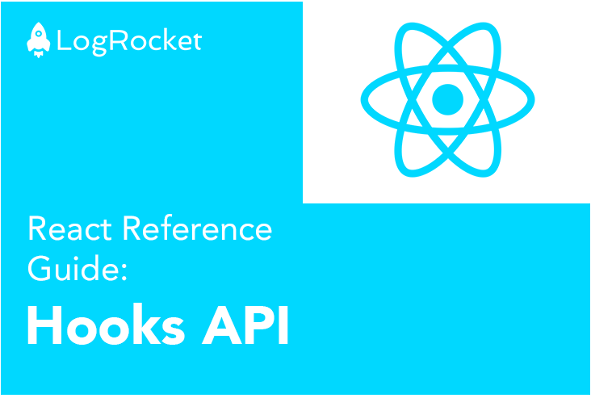

# React Reference Guide: Hooks API

React Hooks were added to React in version 16.8. With the transition from class to functional components, Hooks let you use state and other features within functional components, i.e., without writing a class component.

## Table of Contents

- [React Reference Guide: Hooks API](#react-reference-guide--hooks-api)
  - [Table of Contents](#table-of-contents)
  - [Basic Hooks](#basic-hooks)
    

    
Click to expand!

	
    - [`useState`](#usestate)
      

      
Click to expand!

      - [Functional updates](#functional-updates)
        

        
Click to expand!

	    - [1. New state value depends on the previous state](#1-new-state-value-depends-on-the-previous-state)
	    - [2. Merging object state](#2-merging-object-state)
	    - [3. Avoiding state dependency in other Hooks](#3-avoiding-state-dependency-in-other-hooks)
	  - [Lazily initializing state](#lazily-initializing-state)
	  - [Bailing out of a state update](#bailing-out-of-a-state-update)
	- [`useEffect`](#useeffect)
      

      
Click to expand!

      - [Cleaning up an effect](#cleaning-up-an-effect)
      - [Timing of an effect](#timing-of-an-effect)
      - [Conditionally firing an effect](#conditionally-firing-an-effect)	  
	- [`useContext`](#usecontext)
  - [Additional Hooks](#additional-hooks)  
    

    
Click to expand!

	
    - [`useReducer`](#usereducer)
      

      
Click to expand!

      - [When to use `useReducer`](#when-to-use-usereducer)
      - [The reducer function](#the-reducer-function)
      - [Specifying the initial state](#specifying-the-initial-state)
      - [Lazy initialization](#lazy-initialization)
      - [Bailing out of a dispatch](#bailing-out-of-a-dispatch)
    - [`useCallback`](#usecallback)
    - [`useMemo`](#usememo)
    - [`useRef`](#useref)
    - [`useImperativeHandle`](#useimperativehandle)
	- [`useLayoutEffect`](#uselayouteffect)
	- [`useDebugValue`](#usedebugvalue)
	
## Basic Hooks

### `useState`

#### Functional updates

##### 1. New state value depends on the previous state

##### 2. Merging object state

##### 3. Avoiding state dependency in other Hooks

#### Lazily initializing state

#### Bailing out of a state update

### `useEffect`

#### Cleaning up an effect
#### Timing of an effect
#### Conditionally firing an effect

### `useContext`

## Additional Hooks

### `useReducer`

#### When to use `useReducer`

#### The reducer function

#### Specifying the initial state

#### Lazy initialization

#### Bailing out of a dispatch

### `useCallback`

### `useMemo`

### `useRef`

### `useImperativeHandle`

### `useLayoutEffect`

### `useDebugValue`