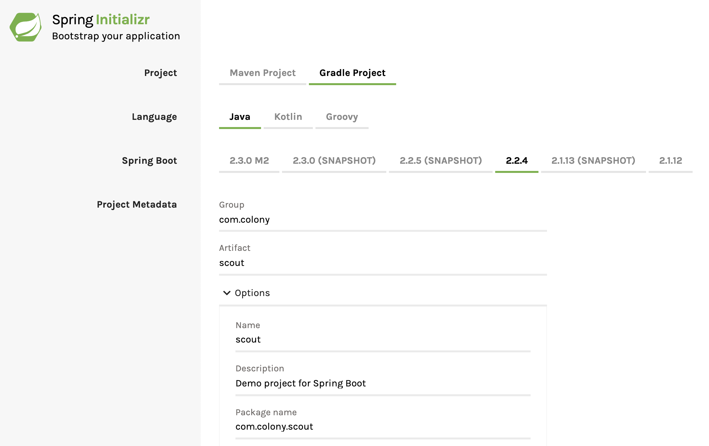
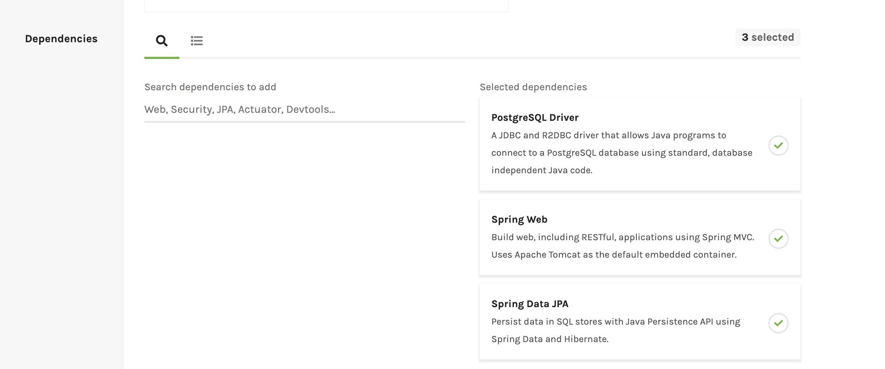

## Secord 🎖️
### Java (Gradle) PostgreSQL Backend with a React/Redux/Typescript Frontend


# Getting Started (prebuilt) 

1. Update the application properties file with your database credentials 

see src > main > resources > application.properties

2. populate the default postgres database with a colonist table and some colonists

see scout.sql

3. Run the App

```
gradle bootRun
```

Open your browser to http://localhost:8080 to see the React frontend

Open your browser to http://localhost:8080/demo/all to see a sample JSON response 

# Getting Started (scratch)

1. visit [spring initializer](https://start.spring.io/)

Setup a new project with these settings:





Generate and download the zip. Open it in your editor and launch a terminal.

2. Install Create React App with typescript & add the [redux toolkit](https://redux-toolkit.js.org/)

```
cd src/main
npx create-react-app webapp --template typescript
yarn add @reduxjs/toolkit
yarn add react-redux @types/react-redux
```

3. Update the application properties file with your database credentials 

see src > main > resources > application.properties


Articles 

* [Serving React apps from Spring Boot](https://blog.indrek.io/articles/serving-react-apps-from-spring-boot/)
* [react & redux toolkit tutorial](https://redux-toolkit.js.org/tutorials/advanced-tutorial)