# How To Create A Native Web Component Without A Framework

***Everyone knows it: encapsulating and reusing UI components on the web is challenging. It is usually copy and paste of HTML, CSS, and JavaScript, often spread over one or more files. If you forget a part, it either does not look as desired, or the interaction will not work. Enough of that! Web Components open up new ways on the web to implement and (re-)use UI components in a standardized manner and without any framework.***

## What to expect

  * Learn how to create a native Web Component without using a framework
  * Explanation of all steps and essentials points like HTML Templates, Custom Elements and shadow DOM to create a Web Component, based on a sample built with Visual Studio Code.

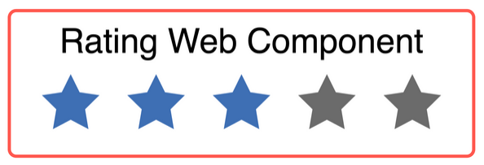

## Table of Contents

- [How To Create A Native Web Component Without A Framework](#how-to-create-a-native-web-component-without-a-framework)
  - [Table of Contents](#table-of-contents)
  - [**What are Web Components?**](#what-are-web-components)
  - [**Create your Web Component template with HTML Templates**](#create-your-web-component-template-with-html-templates)
  - [**Bring your Web Component to life with Custom Elements**](#bring-your-web-component-to-life-with-custom-elements)
    <details>
    <summary>Click to expand!</summary>
    
	- [Create a new Custom Element](#create-a-new-custom-element)
	- [Register your Custom Element](#register-your-custom-element)
	- [The lifecycle model](#the-lifecycle-model)
    - [Attributes vs. Properties](#attributes-vs-properties)
  - [**Encapsulate your Web Component with the shadow DOM**](#encapsulate-your-web-component-with-the-shadow-dom)
    - [Attach a shadow from an HTML element](#attach-a-shadow-from-an-html-element)
  - [**Get your markup inside a Web Component**](#get-your-markup-inside-a-web-component)
  - [**How to style your Web Component**](#how-to-style-your-web-component)
    <details>
    <summary>Click to expand!</summary>
    
	- [Inside the shadow](#inside-the-shadow)
	- [CSS Shadow Parts](#css-shadow-parts)
  - [**Build a Web Component package**](#build-a-web-component-package)
  - [**Will Web Components replace React?**](#will-web-components-replace-react)
  - [**Conclusion**](#conclusion)

## **What are Web Components?**

[Web Components](https://www.webcomponents.org/) are a collection of three technologies:

  * HTML Templates
  * Custom Elements
  * Shadow DOM

With these three technologies, it is possible to develop native Web Components. For the components part, this may lead us to a solution where we might not need to use full-blown frameworks like Angular, React, or Vue.js.

**[⬆ back to top](#table-of-contents)**

## **Create your Web Component template with HTML Templates**

With [HTML Templates](With HTML Templates, you can create your template markup. In order to use a template, you simply have to write your markup inside the <template> tag. But be careful, the template will be parsed but not rendered. This means that the template will appear in the DOM but not be presented in the browser window. Now we start our sample with the HTML Template. In the sample below, we see a template for a simple rating component.), you can create your template markup. In order to use a template, you simply have to write your markup inside the `<template>` tag. But be careful, the template will be parsed but not rendered. This means that the template will appear in the DOM but not be presented in the browser window. Now we start our sample with the HTML Template. In the sample below, we see a template for a simple rating component.

```html
<template>
    <!--Healine-->
    <p>Rating</p>
    <!--rating-stars-->
    <div>
       <div class="rating-star star-1"></div>
       <div class="rating-star star-2"></div>
       <div class="rating-star star-3"></div>
       <div class="rating-star star-3"></div>
       <div class="rating-star star-4"></div>
       <div class="rating-star star-5"></div>
    </div>
</template>
```

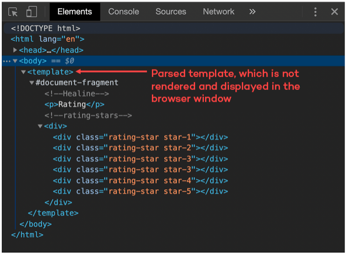

But for our sample, we do not want to write the template in our HTML file. So we create a new JavaScript file `rating.js`. In this JavaScript file, we add a `template` tag via code and assign the HTML content to the `innerHTML` property.

```JavaScript
const template = document.createElement('template');
template.innerHTML = `
<div>
    <!--Healine-->
    <p>Rating</p>
    <!--rating-stars-->
    <div class="rating-stars">
        <div class="rating-star star-1"></div>
        <div class="rating-star star-2"></div>
        <div class="rating-star star-3"></div>
        <div class="rating-star star-4"></div>
        <div class="rating-star star-5"></div>
    </div>
</div>
```

**[⬆ back to top](#table-of-contents)**

## **Bring your Web Component to life with Custom Elements**

With ES6 classes it is possible to create a [Custom Element](https://developer.mozilla.org/en/docs/Web/Web_Components/Using_custom_elements).
The name of your Custom Element must have a dash. In this sample is this `<my-rating></my-rating>`. Standard browser tags like `<body>`, `<div>`, or `<video>` all come without a dash, so you can easily recognize what a browser element is and what a Custom Element is. To create a Custom Element, you must inherit from the HTML Element or any other HTML Element like `HTMLButtonElement`.

### Create a new Custom Element

Now we create a new class `Rating` which inherits from `HTMLElement` and calls the base `constructor` with the method `super` inside our own `constructor` method.

```JavaScript
const template = document.createElement('template');

// ....

export class Rating extends HTMLElement {
    constructor() {
        super();
    }
}
```

### Register your Custom Element

Finally, you need to register your Custom Element. You can do this with one line of code: `window.customElements.define('my-rating', Rating);`

In the example, the `CustomElementRegistry` will be called, to define and register the `my-rating` Web Component as Custom Element in the global `window`.

```JavaScript
const template = document.createElement('template');

/// …

export class Rating extends HTMLElement {
    // …
}

window.customElements.define('my-rating', Rating);
```

After the Custom Element is defined, you can use it in your HTML file. To add this Custom Element and use your Web Component, you must import your JavaScript file. Relevant here is that the script file is added with the type `module`.

```html
<html>
    <head>
        <!--...-->
        <script type="module" src="./rating.js"></script>
    </head>
    <body>
       <my-rating></my-rating> 
    </body>
</html>
```

### The lifecycle model

The lifecycle of a Custom Element has a constructor for the element class and four methods to implement.

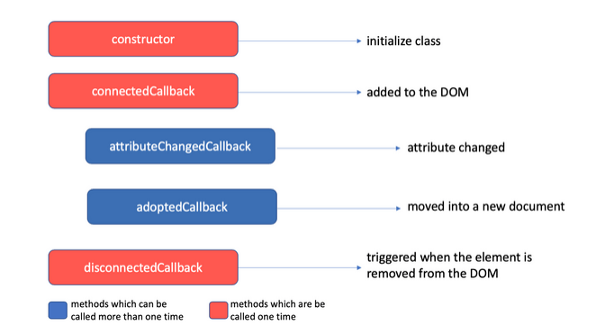

* The first one is the `connectedCallback`: This method will be called when the Custom Element is attached to the DOM.

```html
<!--index.html-->
<body>
    <my-rating></my-rating>
</body>
```

```JavaScript
// rating.js
connectedCallback( {
    console.log('Rating added to DOM');
}
```

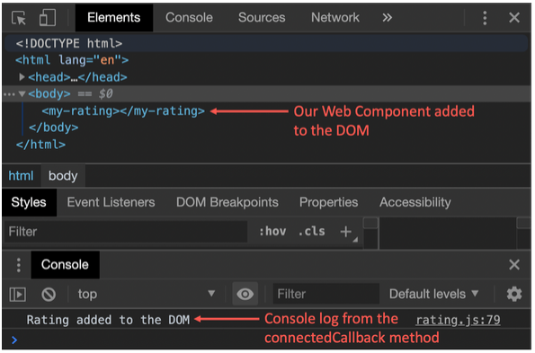

* Second is `adoptedCallback`: This method will be called when the Custom Element is moved to a new `document`.

```JavaScript
//rating.js
adoptedCallback() {
    console.log('Rating was moved into a new DOM');
}
```

* The third callback method is `disconnectedCallback`: This method will be called when the Custom Element is attached to the DOM.

```html
<body>
    <my-rating></my-rating>
    <script>
        document.body.removeChild(document.querySelector('my-rating'));
    </script>
</body>
```

```JavaScript
disconnectedCallback() {
    console.log('Rating removed from DOM');
}
```

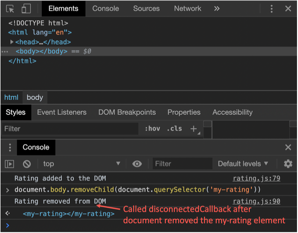

* The last callback method `attributeChangedCallback` needs a little bit more explanation:
  To use the `attributeChangedCallback`, you have to define your attributes, which you want to listen on. To create your attributes, you have to define a static string array called `observedAttributes`, which contains the attributes' names. When you have created the array, you can set the attributes on the Custom Element from outside, and the `attributeChangedCallback` will be called.
  In the sample, we need an attribute for `rating` and `max-rating`.

```JavaScript
// rating.js
export class Rating extends HTMLElement { 
    static get observedAttributes() {
        return [ 'rating', 'max-rating' ];
    }
    
    constructor() {
     //...
    }
    
    // then will attibuteChangedCallback will be calles
    attributeChangedCallback(name, oldVal, newVal) {
      if (oldVal !== newVal) {
         console.log(`${name} changed from ${oldVal} to ${newVal}`)
      }
    }
}
```

```html
<body>
    <my-rating></my-rating>
    <script>
        document.querySelector('my-rating').setAttribute('rating', '3');
    </script>
</body>
```

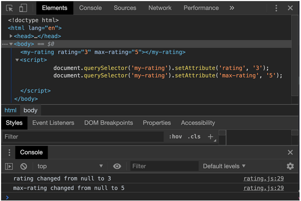

### Attributes vs. Properties

If you use properties and attributes in your class, you must be careful, because property value is not the same as the attribute value. If you wish to sync them, then you will need to implement it. Let's demonstrate that with our example:

```JavaScript
//rating.js
export class Rating extends HTMLElement { 
    static get observedAttributes() {
        return [ 'rating', 'max-rating' ];
    }
    
    constructor() {
     //...
    }
    
    connectedCallback() {
        if (!this.rating) {
            // Set default value to zero
            this.rating = 0;
        }
        if (!this.maxRating || this.maxRating <= 0) {
            // Set default value to five
            this.maxRating = 5;
        }
    }
    
    get maxRating() {
        // be careful: attributes always string, if you want a number, you must parse it on your own. 
        return +this.getAttribute('max-rating');
    }
    
    set maxRating(value) {
        // if you set the property maxRating in this class, you must sync them with the attribute
        this.setAttribute('max-rating', value);
    }
    
    get rating() {
        // be careful: attributes always string, if you want a number, you must parse it by your own.
        return +this.getAttribute('rating');
    }
    
    set rating(value) {
        // if you set the property maxRating in this class, you must sync them with the attribute
        this.setAttribute('rating', value);
    }
    
    attributeChangedCallback(name, oldVal, newVal) {
      if (oldVal !== newVal) {
        switch(name) {
            case 'name':
                this.rating = newVal;
                break;
            case 'max-rating':
                this.maxRating = newVal;
                break;
       }
     }
   }
}
```

**[⬆ back to top](#table-of-contents)**

## **Encapsulate your Web Component with the shadow DOM**

To encapsulate the HTML and CSS from the global scope, we must create our own shadow DOM. With the [shadow DOM](https://developer.mozilla.org/en-US/docs/Web/Web_Components/Using_shadow_DOM), we create an isolated DOM, which is not accessible from the outside. CSS styles are scoped to the shadow DOM—no more ID or class conflicts. Also, conflicts with existing IDs or classes are history.

### Attach a shadow from an HTML element

The shadow DOM has the following concepts:

  * First of all, there is the shadow host: this is the DOM node that the shadow DOM is attached to
  * Second is the shadow tree: this is the DOM tree inside the shadow DOM
  * Next is the shadow root: it is the root node of the shadow tree
  * The last one is the shadow boundary: here, the shadow DOM will end and the regular DOM begins.

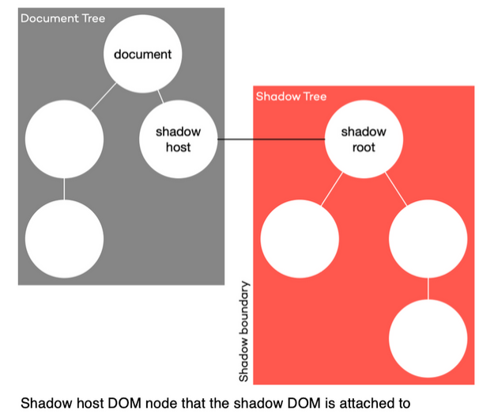

So now, let us attach our HTML Template content to a shadow host.

```JavaScript
//rating.js
const template = document.createElement('template');
// ...

export class Rating extends HTMLElement {
    //...
    constructor() {
        super();
        // attach Shadow DOM to the parent element.
        // save the shadowRoot in a property because, if you create your shadow DOM in closed mode, 
        // you have no access from outside
        const shadowRoot = this.attachShadow({mode: 'closed'});
        // clone template content nodes to the shadow DOM
        shadowRoot.appendChild(template.content.cloneNode(true));
    }
    //...
}
```


In our sample, you see that the shadow DOM is attached to the Shadow Host, which is the parent element `<my-rating>`. The method `attachShadow` has an object as a parameter, where it is possible to set the `mode`. This `mode` property can have two values.

  * The first one is `open`: with this `mode` the shadow root is open to the outside and can be called up.

    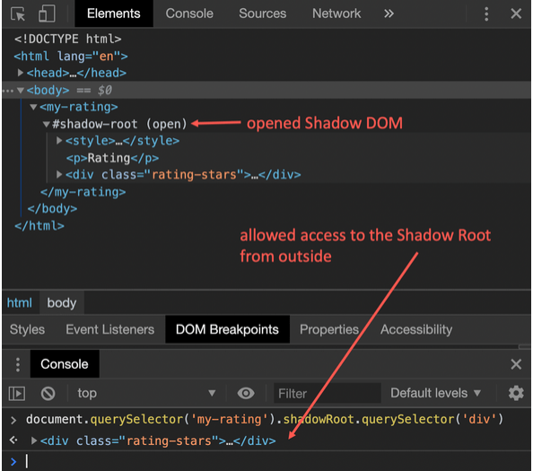

  * Second is `closed` mode: now, there is no access to the shadow root from outside. If you want to use them, you must initialize a local property, like in the sample below.

    ```JavaScript
    const shadowRoot = shadowHost.attachShadow({ mode: 'closed '});
    shadowRoot.querySelector('p');
    // -> [HTMLElement]
    ```	
 
    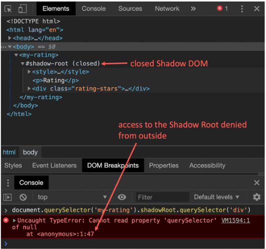

**[⬆ back to top](#table-of-contents)**

## **Get your markup inside a Web Component**

After we have defined a template, created a Custom Element, and attached a shadow DOM, we have all done everything needed to create a Web Component. Now we can have a look at how we bring content from outside, inside our Web Component. Let's start with markup from outside. To allow markup from outside, we can use [slots](https://developer.mozilla.org/en-US/docs/Web/API/HTMLSlotElement). Slots have the HTML tag `<slot>`.

In our sample, we must change a little bit. If we want to have the same count on stars as the `max-rating`, we have to duplicate our star `<div>` tag or the star, which comes from outside. So let's update our template markup.

```JavaScript
// rating.js
const template = document.createElement('template');
template.innerHTML = `
<style>
 // ...
</style>
<p>Rating</p>
<div class="rating-stars">
    <slot>
        <div class="rating-star"></div>
    </slot>
</div>
`;
```

What has changed in the HTML Template:

  * removed all `<div>` tags with the class `rating-star` but one.
  * write the one `<div>` tag inside a new `<slot>` tag.

The next step is to render all rating stars.

```JavaScript
export class Rating extends HTMLElement {
    
    //...

    constructor() {
        super(); 
        const shadowRoot = this.attachShadow({mode: 'closed'});
        shadowRoot.appendChild(template.content.cloneNode(true));
        // assign the div content to a class variable
        this.element = shadowRoot.querySelector('div');
        const slot = this.element.querySelector('slot');
        // assign the rating star to a class variable, that the render class can duplicate them
        this.slotNode = slot.querySelector('div');
    } 
    
    // ...
    
    connectedCallback() {
        //...
        this.render();
    }
    
    render() {
        // ...
    } 
}
```

What has changed in the Custom Element:

  * Assign the content of the first `<div>` element
  * Assign the content of the `<slot>` tag to a class variable `slotNode`, that the new method `render` has access to them.
  * The new method `render()` was created: the method duplicates the `<div>` tag as many times as the `max-rating` attribute indicates.

The last step is that we have to register for the event `slotchange` to find out when a slot has changed. The event will be thrown every time the content of a slot has been changed. With the function `assignedNodes()`, we can get the actual content.

```JavaScript
export class Rating extends HTMLElement {
    
    //...

    constructor() {
        super(); 
        const shadowRoot = this.attachShadow({mode: 'closed'});
        shadowRoot.appendChild(template.content.cloneNode(true));
        // assign the div content to a class variable
        this.element = shadowRoot.querySelector('div');
        const slot = this.element.querySelector('slot');
        // assign the rating star to a class variable, that the render class can duplicate them
        this.slotNode = slot.querySelector('div');
        slot.addEventListener('slotchange', event => {
            const node = slot.assignedNodes()[0];
            if (node) {
                // assign the new node to the slotNode and render the new stars
                this.slotNode = node;
                this.render();
            }
        });
    } 
    
    // ...
}
```

So now, we can change the rating stars from default to our rating star.

```html
<body>
    <my-rating>
        <!-- overwrite the rating star with own img -->
        
    </my-rating>
</body>
```


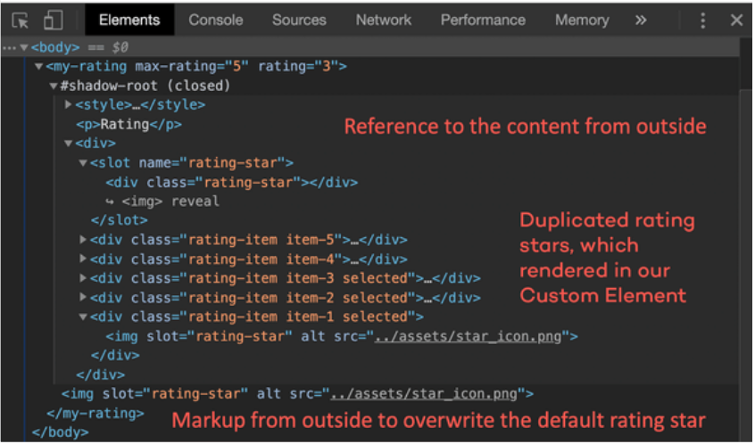

If we want to overwrite more than one item in our template, we must give the `<slot>` tag a `name` attribute.

```JavaScript
const template = document.createElement('template');
template.innerHTML = `
<style>
 // ...
</style>
<slot name="rating-title">
    <p>Rating</p>
<slot>
<div class="rating-stars">
    <slot name="rating-icon">
        <div class="rating-star"></div>
    </slot>
</div>
```

```html
<my-rating>
    <p slot="rating-title">New Rating Title</p>
    
</my-rating>
```


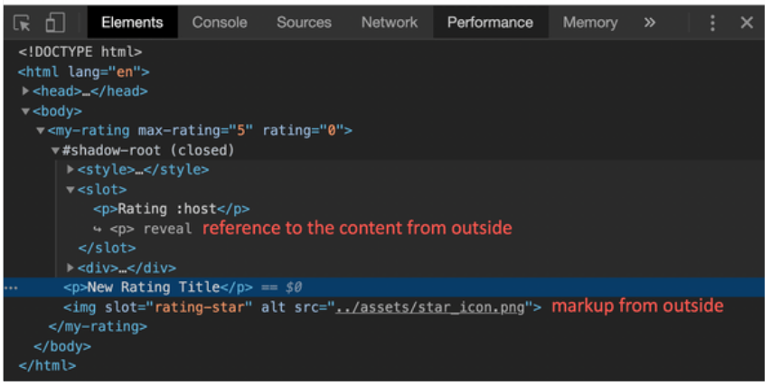

What is striking here is that the title adopts the style from the outside and ignores the style of the Web Component. In the next passage, we have to look at how we can fix this and how we can adapt the style in a specific context.

**[⬆ back to top](#table-of-contents)**

## **How to style your Web Component**

Let us take a look at how we can have access to the styles inside the Web Component.

### Inside the shadow

To style the host of the Web Component, we have four options ([see here](https://developer.mozilla.org/en-US/docs/Web/CSS/:host())):

  * `:host` -> Selects the shadow host element.
  * `:host(context-name)` -> Selects the shadow host element only if it has a certain class.
  * `:host-context(context-tag-name)` -> Selects the shadow host element only, if the selector given as the 
function's parameter matches the Shadow
Host ancestor(s) in the place it sits inside the DOM hierarchy.
  * `::slotted()` -> Selects a slotted element if it matches the selector.

To illustrate this, you will see a small example below, which shows how a Web Component looks in a specific context.

```html
<!-- rating.js -->
<template>
    <style>
        /* default style */
        :host {
            border-color: #ff584f;
        }
        /* style in a specific context */
        :host(.blue) {
            border-color: #3d6fb4;
        }
        /* style inside a specific tag */
        :host-context(main) {
            border-color: #21242d;
        }
        /* style for slotted tags from outside  */
        ::slotted(p) {
            text-align: center;
        }
        /* ... */
    </style>
    <!--... -->
</template>

<!-- index.html -->
<body>
    <!--:host-->
    <my-rating>
    </my-rating>    
    <!--:host(.blue)-->
    <my-rating class="blue">
    </my-rating>
    <!--:host-context(main)-->    
    <main>
        <my-rating>
        </my-rating>
    </main>        
    <!--::slotted(p)-->
    <my-rating>
        <p slot="rating-title">My Rating</p>
    </my-rating>
</body>
```

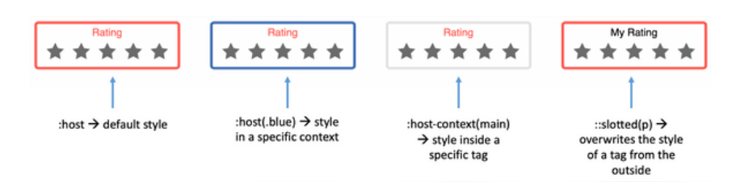

### CSS Shadow Parts

If you want to style your Web Component from outside, you can set the [CSS shadow Part](https://www.w3.org/TR/css-shadow-parts-1/) `::part()`. Also, let us take a look at this in our sample.

```html
<!--rating.js -->
<template>
    <slot name="rating-title">
        <p part="title">Rating</p>
    <slot>
    <div class="rating-stars">
        <slot name="rating-icon">
            <div class="rating-star"></div>
        </slot>
    </div>
</template>

<!--index.html -->
<head>
    <!-- ... -->
    <style>
        my-rating.styled::part(title) {
            text-align: center;
            color: #3d6fb4;
            text-decoration: underline;
        }
    </style>
</head>
<body>
    <my-rating class="styled">
    </my-rating>
</body>
```

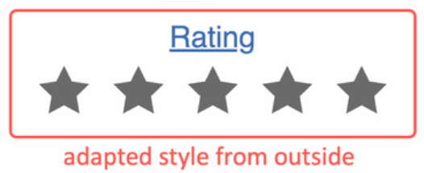

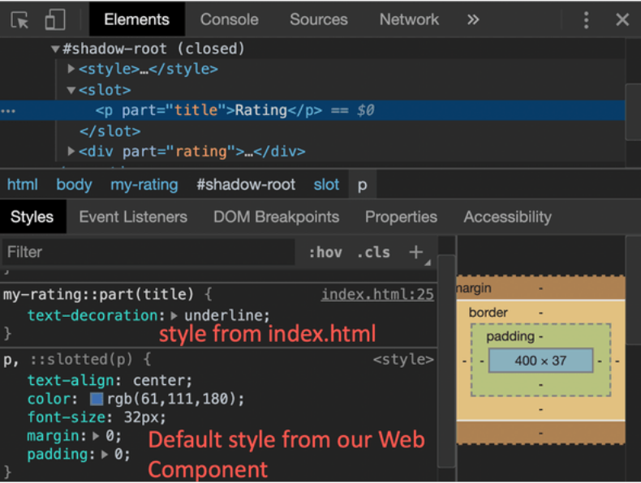

In the sample above, you can see that the style for the title comes from outside and overwrites the style inside the Web Component.

**[⬆ back to top](#table-of-contents)**

## **Build a Web Component package**

The last step is to build your Web Component. Since there is no standardized approach to build it, you can use any tool you desire, like Webpack or Parcel, for instance. In my sample, I built the Web Component with Webpack. To build my Web Component, I use the following `webpack.config.js`

```JavaScript
module.exports = {
    mode: 'production',
    entry: {
        'rating': './src/rating.js',
    },
    output: {
        filename: 'my-rating.js',
    },
    ...
};
```

  * In section `entry` I set the file path to my Custom Element class.
  * In section `output` I set the filename for the bundle file.

To bundle the Web Component, I have set up an npm script `build-wc`:


```JSON
{
  "name": "web-component-demo",
  "version": "1.0.0",
  "scripts": {
    // ...
    "build-wc": "npm run build-wc:clean && npm run build-wc:webpack",
    "build-wc:clean": "rm -rf dist && mkdir dist",
    "build-wc:webpack": "webpack"
  }
  // ...
}
```

At least I run `npm run build-wc` and, the Web Component is packaged in the file `my-rating.js` in the `dist` folder.

**[⬆ back to top](#table-of-contents)**

## **Will Web Components replace React?**

___A modern front-end application needs more than just components___. The great thing about React is that it keeps your components in sync with your data.

When compared with Web Components, React has the following advantages:

  * Allows you to change the underlying data model with state
  * Trigger UI changes based on the state
  * Writing components using functions and hooks
  * A ready to use unidirectional data flow
  * A greater ecosystem of third-party libraries and guides

React’s eco-system is incredibly vast — so much so that it is now possible to use React for everything: Dynamic SPAs, Static pages, Native Android/iOS apps, Windows/Mac desktop apps, CLI apps, etc.

> **Building with React for All Platforms: Top Frameworks and Tools**
>
> [5 recommended frameworks and tools that help you use React to build for all platforms](https://blog.bitsrc.io/building-with-react-for-all-platforms-5-top-frameworks-and-tools-affd5baf3de3)
>
> 
>

That means two things:

  1. You can learn once and build for multiple platforms
  2. You can build once and reuse across different apps

Sharing components (and reusing them across apps) is now easier than ever with tools like [Bit](https://bit.dev/) ([Github](https://github.com/teambit/bit)) that allow you to track components independently and share them, from any project, to a single component hub.

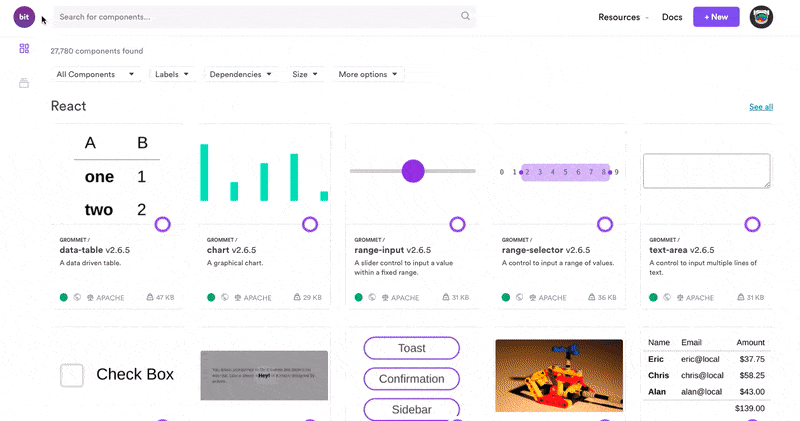

React’s underlying data model with state and props allows its components to change the rendered elements on the screen without imperatively manipulating the DOM or changing attributes manually. When you change the state, React will automatically re-render the components to trigger UI changes.

React also allows you to write components using functions and hooks. When it first came out, hooks are a big improvement to React because it reduces the complexity of managing a component’s lifecycle. It also enables you to write stateful components using functions, completely removing the need to use classes, which confuses both people and machines.

> **Will React Classes Get Deprecated Because of Hooks?**
>
> [React Hooks are a complete and better replacement for Classes. Will React Classes stay with us much longer?](https://blog.bitsrc.io/will-react-classes-get-deprecated-because-of-hooks-bb62938ac1f5)
>
> 
>

Furthermore, functional components in React are easier to maintain because of the way `useEffect` hook gather related logic under one function. For example, when using class components in React, [you need to duplicate your code to run on mount and subsequent updates](https://reactjs.org/docs/hooks-effect.html#example-using-classes):

```JavaScript
class Example extends React.Component {
  constructor(props) {
    super(props);
    this.state = {
      count: 0
    };
  }
componentDidMount() {
    document.title = `You clicked ${this.state.count} times`;
  }
componentDidUpdate() {
    document.title = `You clicked ${this.state.count} times`;
  }
render() {
    return (
      <div>
        <p>You clicked {this.state.count} times</p>
        <button onClick={() => this.setState({ count: this.state.count + 1 })}>
          Click me
        </button>
      </div>
    );
  }
}
```

But with hooks, you can have a `useEffect` function [that runs on mount and subsequent updates](https://reactjs.org/docs/hooks-effect.html#example-using-hooks) in a single function:

```JavaScript
import React, { useState, useEffect } from 'react';
function Example() {
  const [count, setCount] = useState(0);
useEffect(() => {
    document.title = `You clicked ${count} times`;
  });
return (
    <div>
      <p>You clicked {count} times</p>
      <button onClick={() => setCount(count + 1)}>
        Click me
      </button>
    </div>
  );
}
```

When using class components, you need to group unrelated code under the same lifecycle method because that’s the only place where you can run the code reasonably, such as fetching data and setting up listener on `componentDidMount`:

```JavaScript
componentDidMount() {
  // Putting data fetching and listener in the same function
  axios.post();
  DataSource.addChangeListener(this.handleChange);
}
```

With `useEffect` hook, you can separate this unrelated code but run them on the same lifecycle:

```JavaScript
// separating functions to minimize confusion
useEffect(() => {
  axios.post();
});
useEffect(() => {
  DataSource.addChangeListener(this.handleChange);
});
```

As a library for building complete web applications, React also offers a [unidirectional data flow pattern](https://reactjs.org/docs/state-and-lifecycle.html#the-data-flows-down), where data is passed down from parent components to children components with props. Web Components currently requires you to write your own data binding pattern.

Finally, React has a big collection of third party libraries to help developers with the most common application features like:

  * Building forms
  * Fetching asynchronous data from API
  * Developing UI Frameworks
  * Type checking
  * Even building apps visually to some extent

Of course, Web Components may replace React when there is enough support for all of these development needs, but I’m certain by then Web Components won’t be what we know today. Just like React, it will have supporting libraries and even visual builders to allow developers to build applications easier.

Even then, don’t forget that [React is also used outside of web development](https://blog.bitsrc.io/building-with-react-for-all-platforms-5-top-frameworks-and-tools-affd5baf3de3). It’s more likely that Web Components will one day become an alternative option for developing web applications, rather than replace the need for libraries entirely.

**[⬆ back to top](#table-of-contents)**

## **Conclusion**

In this article, we have looked into the world of Web Components based on a sample component. Web Components consist of the three specifications **Custom Elements**, **shadow DOM**, and **HTML Templates**. If we combine these specifications, it is possible to create own HTML elements that also hide their implementation details from their environment and encapsulate them. This makes it possible to create components that can then be reused in other applications. When taking a look at the statistics of [Can I Use](http://caniuse.com/) on Custom Elements, shadow DOM and HTML Templates, it will become apparent that all three features already arrived in modern browsers like Chrome, Safari and Edge.

To get a little bit more help to build Web Components and get a bit more browser compatibility, you can use [LitElement](https://lit-element.polymer-project.org/). LitElement is a simple base class from the [Polymer Project](https://www.polymer-project.org/) to create fast and lightweight Web Components.

So try it out, fiddle around with them, and create your first small Web Components for your application. If you want to see all the code and try out the sample, you can [find the demo here](./demo/README.md).

Web Components is a set of different technology being used together to help you write reusable elements that are encapsulated from the rest of your code. On the other hand, React is a JavaScript library meant to help you write user interface in a declarative way.

A scalable modern front-end development requires many other things besides components. That’s why you don’t have to be afraid to use React and its ecosystem of tools and libraries. It surely won’t be replaced by Web Components anytime soon.

**[⬆ back to top](#table-of-contents)**