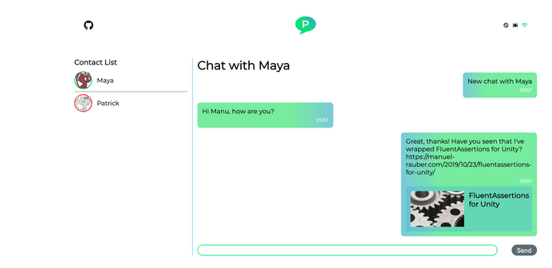
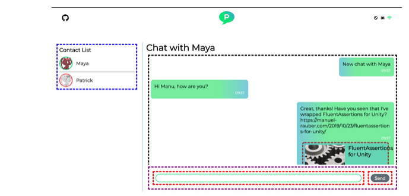
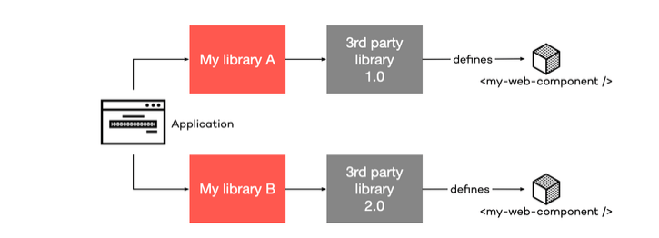

# Web Components - A Four Part Series

## Table of Contents

- [Web Components - A Four Part Series](#web-components---a-four-part-series)
  - [Table of Contents](#table-of-contents)
  - [**Part 1: The Motivation for Web Components and Introduction**](#part-1-the-motivation-for-web-components-and-introduction)
    <details>
    <summary>Click to expand!</summary>

	- [The Motivation for Native Web Components](#the-motivation-for-native-web-components)
    - [The Demo Application](#the-demo-application)
	- [Goal](#goal)
  - [**Part 2: Perks of Web Components**](#part-2-perks-of-web-components)
    <details>
    <summary>Click to expand!</summary>
    
	- [Technical Perks of Web Components](#technical-perks-of-web-components)
      - [Reusability](#reusability)
	  - [Semantics](#semantics)
	  - [Encapsulation](#encapsulation)
	- [Business Perks of Web Components](#business-perks-of-web-components)
	  - [Reusability](#reusability)
	  - [Browser Standards](#browser-standards)
	- [Summary](#summary)
  - [**Part 3: The Flaws of Web Components (And Possible Solutions)**](#part-3-the-flaws-of-web-components)
    <details>
    <summary>Click to expand!</summary>
    
    - [Versioning](#versioning)
	- [Attributes vs. Properties](#attributes-vs-properties)
	- [Global Scope](#global-scope)
	- [Boiler Plate & Render Loop](#boiler-plate--render-loop)
    - [Template Engine](#template-engine)
	- [Editor Support](#editor-support)
	- [Build Pipelines](#build-pipeline)
	- [Forms](#forms)
	- [Stacking UI](#stacking-ui)
	- [Conclusion](#conclusion)
  - [**Part 4: Data Sharing & Framework Integration**](#part-4-data-sharing--framework-integration)
    <details>
    <summary>Click to expand!</summary>
    
    - [Sharing Data and Services](#sharing-data-and-services)
	- [Creating Web Components with Frameworks](#creating-web-components-with-frameworks)
	- [Conclusion](#conclusion)

Web Components - a term you most probably hear regularly in recent times as a web developer. With the standards of [Shadow DOM](https://developer.mozilla.org/en-US/docs/Web/Web_Components/Using_shadow_DOM), [HTML Custom Elements](https://developer.mozilla.org/en-US/docs/Web/Web_Components/Using_custom_elements), [HTML Templates](https://developer.mozilla.org/en-US/docs/Web/HTML/Element/template), and, in former times, HTML Imports, there finally is a native component model within the browser. In this four-part article series, we are exploring the perks and flaws of Web Components within a demo application. This demo will show how frameworks like Angular, React, Vue, LitElement, and Stencil.js can seamlessly work together in one application as Web Components.

## **Part 1: The Motivation for Web Components and Introduction**

### The Motivation for Native Web Components
If you develop desktop applications or Single-Page Applications (SPA), you are used to components.

A component encloses three things:

* User Interface: the elements a user can interact with and see data.
* Style: defines how to render the user interface, for instance colors, margins or fonts.
* Code: functions to handle user input events as well as updating the data presented to the user and communicate with other services.

If you consider these three elements, the component usually is reusable. Multiple components compose the final application. We can create or use component libraries to help other developers to build their application.

Whereas back in the days, libraries like jQuery UI or Bootstrap helped to create reusable components, today frameworks as Angular, React, and Vue take over and have a commonality: they offer the developer a component model. Angular has a `@Component` decorator that turns a pure class into a component, React extends from `React.Component`, and Vue has a function `Vue.component`. Additionally, all frameworks offer some lifecycle methods for developers to hook into, for example, when the framework creates or destroys a component at runtime.

If you now move from one framework to another, you have to relearn the following, amongst other things:

* the component model
* how the framework invokes lifecycle methods
* how to bind data from code to UI
* how to react to UI events in your code

Imagine, if the browser has a native component model, you only need to learn it once. That has several advantages. As a developer, you can easily switch between projects or even companies that are using Web Components. For companies, you have higher reusability of developed components, because they can be used either standalone or within any other framework. As a result, you do not need to hire someone who knows how to develop a framework component, but rather someone who can create Web Components and still use these in your framework code. Vice versa, if you want to turn your framework component into a Web Component and then use it where ever you want. Welcome to the world of Web Components!

**[⬆ back to top](#table-of-contents)**

### The Demo Application

A real-time chat application demo **Palaver** accompanies this article series. Besides the source that is available on [GitHub](https://github.com/thinktecture-labs/web-components-chat), there is also [a live demo](https://tt-web-components-chat-ng.azurewebsites.net/) available. I recommend reading through the readme file to compile and start the project on your machine.

A lot of Web Components demos mostly showcase one single feature of it, which is helpful if you are interested in that particular feature.

However, if you want to see how everything works together, especially when current frameworks are involved, hands needed to get dirty to write such a demo from scratch.

Let's have a look at Palaver first:



The demo shows a real-time chat application with a Node.js & Socket.io backend. Several Web Components compose the frontend. If you turn on the special demo mode with the neat little spider icon in the top right corner, the demo reveals the Web Component for each part.



Every dashed line, as seen in the picture, is a Web Component. The color identifies the framework, the number in the brackets denotes the version used in Palaver:

  * **Red:** [native Web Components without a framework](https://webcomponents.org/)
  * **Purple:** [Stencil.js](https://stenciljs.com/) (1.3.0)
  * **Black border:** [Angular Elements](https://angular.io/guide/elements) (8.2.4)
  * **Brown** (around the "FluentAssertions" image): [LitElement](https://angular.io/guide/elements) (2.2.1)
  * **Blue:** [React](https://reactjs.org/) (16.9)
  * Not in the picture here, but on the Login Dialog screen: [Vue.js](https://vuejs.org/) (2.6.10)

Being an Angular developer, I built the application housing all the Web Components and providing the necessary services with Angular.

#### Features

The features of Palaver are:

  * Contact list with all users currently online
  * Chat history ([IndexedDb](https://developer.mozilla.org/en-US/docs/Web/API/IndexedDB_API) & [Dexie.js](https://dexie.org/))
  * Real-time online/offline recognition of other users
  * Link preview generation

**[⬆ back to top](#table-of-contents)**

### Goal

The goal of this demo is to have a real application including inputs/outputs, data flow, forms, and updates in order to get more insights about working with Web Components within frameworks and how to build them from frameworks. Please have in mind that the application is still a demo application, so some shortcuts and little workarounds may be involved.

Read the second article of this series about [the perks of Web Components](#part-2-perks-of-web-components).

**[⬆ back to top](#table-of-contents)**

## **Part 2: Perks of Web Components**

In the [introduction](#part-1-the-motivation-for-web-components-and-introduction) article to this series, I wrote about the motivation, why to use Web Components. Now we are going to take a closer look at the perks of using them - from a technical and business point of view. If you are interested in all technical features of Web Components, [I would recommend a more in-depth article from my colleague](https://www.thinktecture.com/web-components/native-web-components-without-framework/).

### Technical Perks of Web Components
In this section, we are taking a look at the technical perks, which help you as a developer to create, use, maintain, and share your precious Web Components.

#### Reusability
Web Components rely on the browser's native component model implementation and not on other frameworks. That makes it easy to reuse the component across multiple applications - either your in-house or external ones. Additionally, every current SPA framework can consume Web Components and, if needed, wrap it into a framework component providing additional services. You can develop your component once and use it everywhere you like.

#### Semantics
If you think of good old components years ago, you may have seen code similar to this:

```html
<html>
  <head>
    <script src="fancyFramework.js"></script>  
  </head>
  <body>
    <div id="fancyWidget"></div>
  </body>
</html>
```

Taking a look at it, there is literally no semantics. You only have a `div` element with a specific `id` on it. However, you don't know anything about it. It is not visible if that is a component at all, and if so, which one it is. Additionally, without having more documentation, there is no hint about the component's API. Depending on the component, you may need to include one or several stylesheets as well.

At runtime, the `fancyFramework` may expand the `div` with additional elements like this:

```html
<body>
  <div id="fancyWidget">
    <span class="label">Label</span>
    <button class="increment button">+</button>
    <button class="decrement button">-</button>
  </div>
</body>
```

You can notice that some of the selectors are generic, `label` or `button` for instance. Either your own application or another third party framework likely defines the same classes. That leads to overwriting styles and breaking your UI. If the expansion would insert elements having a specific ID, the component is single-use. According to the specification, an ID should be used only once per page.

Taking a look at Web Components the sample above will look like that:

```html
<html>
  <head>
    <script type="module" src="my-counter.js"></script>  
  </head>
  <body>
    <my-counter value="1" minimum="-5" maximum="5"></my-counter>
  </body>
</html>
```

Several things have changed here! At first, we have a bundle import. Importing the `my-counter` JavaScript module also includes the necessary stylesheets. Everything is in one place, and you don't have to import anything else.

Instead of having a `div` tag, we now have a `my-counter` tag due to the usage of [Custom Elements](https://developer.mozilla.org/en-US/docs/Web/Web_Components/Using_custom_elements). It is adding much more semantic to the code because you precisely know the component used. Due to the attributes, it also exposes the API of the component. So you can see that this component has a `value`, a `minimum` and a `maximum`.

Last but not least, it has a local scope due to [Shadow DOM](https://developer.mozilla.org/en-US/docs/Web/Web_Components/Using_shadow_DOM). Neither there is style bleeding into the component, nor a style overwrite from the component. Your UI does not break.

#### Encapsulation
As mentioned in the paragraph before, a Web Component is locally scoped. It is encapsulated because of Shadow DOM. Consider the following sample:

```html
<html>
  <head>
    <script type="module" src="my-counter.js"></script>
    
    <style>
      label {
        color: red !important;
      }
    </style>  
  </head>
  <body>
    <my-counter value="1" minimum="-5" maximum="5">
      <!-- Inside the Shadow DOM; NOT content projection -->
      <label>A label</label>
    </my-counter>
  </body>
</html>
```

Without the usage of Shadow DOM, the style definition from the main document would bleed into the component, coloring the label red. Even if there is another styling defined in the component itself, the `!important` overwrites it.

However, since your Web Component uses Shadow DOM, no style bleeding occurs. No matter how you try to overwrite it, the browser ignores CSS outside of the Web Component. **Except** if your Web Component defines CSS variables, then you can use those variables in your main document to overwrite the ones defined in the Web Component. And that's a good thing because you, as a component developer, are responsible for creating those CSS variables. Basically, you build an UI API for your consumers, where you want them to be able to overwrite certain aspects, like sizes or colors. Besides, you can also use [CSS Shadow Parts](https://www.w3.org/TR/css-shadow-parts-1/) for defining elements that can be styled by the user. Again, that's good, because you can specify which elements can be styled - it is your API.

As mentioned in the introduction, if you are curious about more in-depth technical aspects of Web Components, check out my colleagues' article about [native Web Components without a framework](https://www.thinktecture.com/en/web-components/native-web-components-without-framework/).

**[⬆ back to top](#table-of-contents)**

### Business Perks of Web Components
In this section, we are exploring in which ways Web Components can help your business.

#### Reusability
We talked about this in the technical perks section above already, but it is worth mentioning on the business side, too!

Since we can share Web Components easily, that also implies we have to develop them only once. We have one code base (to rule them all) we need to manage instead of multiple ones, with possible re-development of already existing components. That helps tremendously to write high quality and highly tested code. Also, it includes that code is easier to maintain. All in all, the overall developer experience gets better.

But, you still need proper PR review processes, linter rules, auto-code formatting tools, and further. The benefit is that everyone, every SPA framework, and every website can consume your Web Components.

Additionally, Web Components help to increase the consistency of your application, the look and feel of your brand. Since all teams use the same components, the applications look and feel the same. The developers can focus on creating specific features for each application without having to redevelop the brand's look and feel.

#### Browser Standards
In the technical section, I have mentioned the usage of several browser standards like Shadow DOM or HTML Templates. Utilizing them and training people on the standards makes it easier to share knowledge and developers between projects. It does not happen anymore that someone cannot help in a project, because he is an Angular developer, but the project is using React.If both use Web Components, your tools are JavaScript, HTML, and CSS. Languages, which are well-known to any experienced Web Developer.

**[⬆ back to top](#table-of-contents)**

### Summary
In this article, we learned a lot about the perks of Web Components. They are not only a time-saver in development but also a money-saver in business due to the high reusability and hopefully better maintainable code.

When creating Web Components, we also need to think about our APIs. On the one hand, we have the JavaScript APIs. On the other hand, there are CSS APIs with Shadow Parts and CSS variables. Thinking about and shaping your component's API helps to create small, reusable, and very specific Web Components.

Where perks are, there are also flaws. Find more about [the downsides of using Native Web Components](#part-3-the-flaws-of-web-components) in the third part.

**[⬆ back to top](#table-of-contents)**

## **Part 3: The Flaws of Web Components (And Possible Solutions)**
The first article of this series introduced into the [motivation for using Web Components](#part-1-the-motivation-for-web-components-and-introduction). After looking at [the perks in the second part](#part-2-perks-of-web-components), we are going to learn about the flaws of Web Components in this article.

Please note that with the on-going development of the standards, some flaws discussed here by the time of writing this may not exist anymore - which would be good news!

### Versioning
Take a look at the following picture. Assume we are working with two teams. Both teams develop a library, A and B. The final application includes both libraries. Both teams decide to use a third party Web Component library in version 1.0. With more and more on-going development, one team decides to use the next version of the third party library.



That's a pretty common scenario, e.g., the team wants to use a new feature or needs a bug fix. Since both teams include the library in a different version, both teams are shipping the third party library with their developed library. By doing so, both libraries now define the same Web Components due to the usage of the same third party library. At runtime, your application crashes with the following message:

> `Uncaught DOMException: Failed to execute 'define' on 'CustomElementRegistry': the name "my-web-component" has already been used with this registry.`
>

The problem is that `CustomElementRegistry` is a global window object. Once a Web Component has registered a custom HTML tag, you can not register the same tag again. Furthermore, your application will likely not work now because some of the components can not be loaded.

#### A Solution
The W3C is currently discussing a [Scoped Custom Element Registry](https://github.com/w3c/webcomponents/issues/716), which would define at what place in the DOM, which Custom Element Registry is used for registering HTML tags and where they are valid. It is interesting what they are discussing and how to implement it. I would highly recommend reading through the comments.

Additionally, if you need to solve the problem right now, you can do several things:

  * Version your HTML tags `<my-custom-element-v1></my-custom-element-v1>` - as long as you use semantic versioning, your v1 will never break any existing application using that version. Be aware that this is quite uncommon for HTML tags and should only be used if there is no other way to solve it.
  * Libraries never load other custom Web Components, but the host application does. In this case, a library can use Web Components but does not load the code itself. It may suggest to the host application which library to load, but it's the host application's decision which Web Components to load. It could be that different libraries expect a specific version of a Web Component, which could break if a newer or older version is loaded.
  * You develop your Web Components in a way that they are backward compatible all the time within their lifetime. That sounds a bit impossible to achieve, but if you think of small, very specific Web Components, it may not be that hard to do so.
  * Last but not least, you can conditionally register a Web Component, by checking if another with the same name is registered or not using `window.customElements.get()`. But you still could have the problem, that the wrong version of your expected Web Component version is loaded

```JavaScript
if (!window.customElements.get('my-web-component')) {
    window.customElements.define('my-web-component', MyWebComponent);
}
```

**[⬆ back to top](#table-of-contents)**

### Attributes vs. Properties
This problem is not new due to Web Components. It has been around all the time. Maybe it has been forgotten thanks to current Single Page Application frameworks. Let's take a look at the following pieces of code.

```JavaScript
input = document.createElement('input');

console.log(input.getAttribute('value'));
input.value = 'one';
console.log(input.getAttribute('value')); 

input.setAttribute('value', 'two');
console.log(input.value); 
```

Without executing this beauty in your browser's console - can you tell what the output of the three `console.log()` will be? Here is the answer:

```
null
null
one
```

I guess that some of you expected that output and others did not, especially if you do not have a web development background. Let's see what is exactly happening here.

At line 1, we are creating a new `<input>` element. Then we query its attribute at line 3, which is, obviously, `null`, since we did not set the value of the input. However, with line 4, we are setting an input value, and after that, it is still null. It is simple we are setting the **property** of the input element, and not its **attribute**.

The same is true with the two last lines. At first, we set the **attribute** to two, and then we access the **property**, which is still one.

Every Web Component (or in this case HTML element) has a JavaScript state (the **properties**) and its DOM representation (the **attributes**). Depending on how you are going to use your Web Components, it is excellent that they do not reflect each others state.

#### A "Solution" ( Not a real solution )
I am not calling this the real solution and would not recommend doing that every time since it depends on your Web Component if the following makes sense.

"The solution" is called **Reflecting properties to attributes** or sometimes called **Reflected DOM attributes**. The implementation is rather easy for the example above:

```JavaScript
class HTMLInputElement extends HTMLElement {
    constructor() {
        super();    
    }
    
    set value(v) {
        this.setAttribute('value', v);   
    }
    
    get value() {
        this.getAttribute('value');
    }
}
```

Easy, right? **But** take care that an HTML attribute only supports strings while a JavaScript property supports anything you assign to it. By that, if you want your component to always reflect its state to HTML attributes, you may need to `JSON.stringify` and `JSON.parse` them. **Take care** if you assign complex data structures to your properties then, since parsing and stringifying them could have a serious performance impact!

Be careful what kind of data you are going to reflect on DOM attributes and what data should stay in properties only. In the end, document your Web Component, so your users know which attribute and properties are usable.

Additionally, if you are implementing `attributeChangedCallback` make sure, you are not setting the property in there, which then will set an attribute again. That will trigger `attributeChangedCallback` once more, leading to an infinite loop.

**[⬆ back to top](#table-of-contents)**

### Global Scope
The Shadow DOM of a Web Components helps to encapsulate CSS and HTML, but not JavaScript. Whenever you assign something to the global `window` object, anyone has access to it.

On the one hand, you can use a global object to your advantage, like if you need to share component library-wide settings. On the other hand, it may lead to errors, for example, if you build Angular Elements with `zone.js`. `zone.js` monkey-patches global functions like `setTimeout` or `requestAnimationFrame`. Every Angular Element tries to patch via zone.js, but zone.js recognizes if a function has already been patched and throws an error.

#### A Solution

If you need real JavaScript encapsulation, your only solution is an `<iframe>` tag. Only an iFrame provides a real second DOM in your browser, without the possibility of directly accessing other DOMs. To communicate, you need to use the `window.postMessage` API or `Channel Messaging`.

Often, you do not need a real second DOM, but just a possibility to bundle your JavaScript in a way it does not interfere with other scripts. If that is the case, one of the modern JavaScript bundlers will help you and create CommonJS or AMD modules from your code.

If you are in the world of Angular building Web Components with Angular Elements, make sure your components use `OnPush` change detection. That way, you can remove zone.js for your element.

**[⬆ back to top](#table-of-contents)**

### Boiler Plate & Render Loop

This problem is arising if you build Web Components from scratch, without any framework or other underlying foundations. It is basically plain HTML, CSS, and JavaScript. You find yourself attaching and removing event listeners via `addEventListener` and `removeEventListener`, implement the lifecycle callbacks, react to attribute changes, or decide when and how to update the DOM. Those things are normally handled by a modern framework having change detection and virtual DOM.

For smaller components that may manageable, but if you think of writing bigger components or whole component libraries, you are going to repeat a lot of things. This may not be bad if you do not want to have a dependency to other frameworks. But, it could increase your development and review time of components to check, if everything was implemented properly.

#### A Solution

For your own component libraries, you can build your own core foundation framework, which is used by all other Web Components to share basic functionality. That could be a bigger task, but in the end, you will not have any dependency on other frameworks. This way, you may have the smallest possible output - file-size-wise.

If you are going that way, [Constructable Stylesheets](https://wicg.github.io/construct-stylesheets/) could help you to share common CSS amongst your Web Components. But take care! Constructible Stylesheets are currently a collection of ideas, no standard, not even a draft. It currently works in Chrome, but there is no guarantee it will stay there or work in other browsers as well. Your best option for sharing CSS is handling it via SCSS in a build process or using CSS variables.

If you do not want to develop your own core foundation framework, you may take a look at a Web Component oriented frameworks, like [Stencil.js](https://stenciljs.com/), which help to solve building a strong foundation for your Web Components. It already takes care of the things mentioned above.

**[⬆ back to top](#table-of-contents)**

### Template Engine
A template engine helps to define placeholders or add and remove event handlers for certain events. Behind the scenes, a template engine generates the needed code to replace the placeholder with actual content or call `addEventListener`/`removeEventListener` for your event handlers.

But in native Web Components, there is no template engine build in. By that, you have to utilize the standard JavaScript functions for adding and removing event handlers. For placeholders, you may have to define a span element with a certain ID or class, which you can fill via `textContent` or `innerHTML`.

#### A Solution

For example, the LitElement component I developed for Palaver looks like this:


```JavaScript
get previewTemplate() {
  return html`
  <div @click="${this.clickHandler}" class="preview">
    ${this.preview.image
      ? html``
      : html``
    }
    
    <div>
      <header>${this.preview.title}</header>
        ${this.preview.description
          ? html`<p>${this.preview.description}</p>`
          : html``
        }
    </div>
  </div>
  `;
}
```

It is kind of ok to read thanks to the template strings and LitElement also does some magic for setting event listeners with its `@click` syntax.

Another example is the Stencil.js component from Palaver:

```JavaScript
export class MessageComposerComponent {
  @Event() messageComposed: EventEmitter<string>;
  @State() value: string;
  @State() isInvalid: boolean = true;

  private messageComposedHandler() {
    if (this.isInvalid) {
      return;
    }

    this.messageComposed.emit(this.value);
    this.value = '';
    this.isInvalid = true;
  }

  textInputChange(value: string) {
    this.value = value;
    this.isInvalid = !this.value;
  }

  render() {
    return <form>
      <native-web-component-text-field onValueChange={e => this.textInputChange(e.detail)} value={this.value} />
      <native-web-component-button onClick={() => this.messageComposedHandler()} disabled={this.isInvalid}>
        <slot name="button">Send</slot>
      </native-web-component-button>
    </form>;
  }
}
```

Thanks to JSX, this example has better readability. Additionally, IDEs/code editors, like WebStorm or VS Code, understand JSX syntax for improved IntelliSense.

**[⬆ back to top](#table-of-contents)**

### Editor Support

Having a good IDE support is the foundation of building software. Which IDE or editor you use, is a matter of taste. I (personally) love the JetBrain's IDEs WebStorm, Rider, etc.

When it comes to code completion support for Web Components there is none. Your IDE will not know which properties or attributes your Web Component supports. There is no type definition or something else.

If you are importing your Web Components from a 3rd party source, you can only take a look at the code or at the documentation to know which properties and attributes are supported.

#### A Solution

Currently, Stencil.js is creating Type Definitions for your Web Components (along with an auto-generated documentation), which is pretty neat. Additionally, [the W3C is discussing how to do general editor support with a metadata json file](https://github.com/w3c/webcomponents/issues/776). Stencil and Visual Studio Code are implementing proof-of-concepts to support that and gain first insights about the proposed solution.

In the future, that metadata json file will also be read by other IDEs to significantly improve the editor support. In the meantime, consult the documentation of your Web Components.

**[⬆ back to top](#table-of-contents)**

### Build Pipelines

When you are developing with the latest and greatest technology, there is often a drawback when it comes to the build pipelines. I remember playing around with Angular 2 alpha 41, which was one of the first public releases for Angular 2. There was no CLI or something, you had to write your own scripts to compile everything together. As you can imagine, that was not so easy to do, because all tooling around Angular, event TypeScript, was pretty new.

Having a working and flexible build pipeline is an improvement to any project. A build pipeline takes over tasks like

  * asset management (copy referenced assets to the correct output folder),
  * transpile source file (like TypeScript, SCSS, etc.),
  * post-process CSS and/or
  * uglify/obfuscate code

Without any framework involved, there is simply no build pipeline for Web Components. Everything you need, you need to do yourself!

#### A Solution

Since Web Components are not a new technology, you can use tools you know from web development, like [webpack](https://webpack.js.org/) or [Parcel.js](https://parceljs.org/). They help tremendously packing your Web Components, transpiling languages, post-process CSS and to have a possibility to split your Web Components into several files and let the packager load CSS/HTML into your Web Component.

But, you still have to write the scripts for that, maybe for a debug mode with source maps and a production mode without source maps and code uglifying. Again, I have to mention StencilJS, which already has a working build pipeline for you to use.

**[⬆ back to top](#table-of-contents)**

### Forms

Most web applications require a form for the user to input some data. For example, a little login dialog:

```html
<form>
    <label for="username">Username</label>
    <input id="username" type="text" />
    <label for="password">Password</label>
    <input id="password" type="password" />
    <button type="submit">Login!</button>
</form>
```

You typically have an input for a username and a password. Additionally, there is a button to submit the form. In that case, the form data is populated and you can use it in JavaScript. As you can see, we have to repeat some elements, so let us craft that into a more Web Component'ish approach:

```html
<form>
    <my-input type="text" name="username">Username</my-input>
    <my-input type="password" name="password">Password</my-input>
    <my-button type="submit">Login</my-button>
</form>
```

Now we have saved some keystrokes, it looks cleaner, and we are good to go. Within each Web Component, there's a real `<input>` and `<button type="submit">` element. Basically, the browser will render the following DOM:

```
- form
    - my-input
        - Shadow DOM
            - label
            - input
    - my-input
        - Shadow DOM
            - label
            - input
    - my-button
        - Shadow DOM
            - button 
```

If you would try out the form, nothing will work anymore. We encounter two problems here.

The first problem is that whenever an input element is put into a Web Component, **it will not populate its enclosing forms data**. Whatever you type into your input, the form data will never have any content.

The second problem is, that whenever a submit button is put into a Web Component, **it will not submit its enclosing form**. You can press the button, but nothing is working.

#### A Solution

Currently, there are three solutions to overcome that problem.

**1. Form Participation API**

If you have some patience, you can wait until the APIs have been discussed by WhatWG/W3C and will be implemented into the browsers. The API is called [Form Participation API](https://docs.google.com/document/d/1JO8puctCSpW-ZYGU8lF-h4FWRIDQNDVexzHoOQ2iQmY/edit?pli=1#) (or sometimes referred to Form Attached Control).

There are a lot of interesting issues about that:

  * [Implicit submission](https://github.com/w3c/webcomponents/issues/815)
  * [Being a submit button](https://github.com/w3c/webcomponents/issues/814)
  * [Missing features for form-associated custom elements](https://github.com/whatwg/html/issues/5016)
  * [Activation behavior](https://github.com/whatwg/html/issues/5009)
  * [Very interesting is also the discussion about focusable elements and tabindex](https://github.com/whatwg/html/issues/5009)

**2. Use Shadow DOM Slots**
If your Web Component architecture allows it, you can use the [Shadow DOM Slots](https://developer.mozilla.org/en-US/docs/Web/Web_Components/Using_templates_and_slots).

Imagine, you have the following Web Component:

```JavaScript
const template = document.createElement('template');
template.innerHTML = `
  <input name="my-input-element" />
`;

class MyCounter extends HTMLElement {
  constructor() {
    super();

    this.shadow = this.attachShadow({ mode: 'open' });
    this.shadow.appendChild(template.content.cloneNode(true));
  }
}

window.customElements.define('my-input', MyCounter);
```

As mentioned, the problem is that the `<input>` is within the Web Component itself, but the `<form>` element is outside of it. If you are using slots, the Web Component will look like this:

```JavaScript
const template = document.createElement('template');
template.innerHTML = `
  <slot></slot>
`;

class MyCounter extends HTMLElement {
  constructor() {
    super();

    this.shadow = this.attachShadow({ mode: 'open' });
    this.shadow.appendChild(template.content.cloneNode(true));
  }
}

window.customElements.define('my-input', MyCounter);
```

The usage will be:

```html
<form>
  <my-input>
    <input name="my-input-element" />
  </my-input>
</form>
```

The difference is that the `<input>` elements do not belong to the Shadow DOM of your Web Component but to the Main DOM. In that case, the `FormData` of your form will be correctly populated. If you need to style your input field, you can easily use the `::slotted` [CSS pseudo-element](https://developer.mozilla.org/en-US/docs/Web/CSS/::slotted). For sure, you will need some JavaScript in your Web Component to get the name, maybe set the `id` attribute for creating a label. Do that with all your form elements (even the submit button) and the form will work as expected and taking advantage of Web Components.

3. Wire manually

Assign event listeners to the button and to the input field, raise a custom event, and react to it in the enclosing form to rebuild the wished behavior. As you can imagine, this is only a workaround and not a real solution. But, a part of that has been implemented in the [Palaver demo application](https://github.com/thinktecture-labs/web-components-chat/blob/d30ef398f8803ddad4bc905983813b7d797a8674/frontend/web-components/stencil-components/src/components/message-composer/message-composer.component.tsx).

**[⬆ back to top](#table-of-contents)**

### Stacking UI

Most of our application needs to stack UI on top of another. Think of modal dialogs, tooltips, select boxes, menus, context menus, and so on. But, depending on how your Web Component is used and transformed, you may not be able to come to the top layer:

```html
<body>
    <my-web-component-a style="width: 100px; height: 100px; position: absolute; transform: rotate(90deg)">
        <!-- Will be transformed, but should be a top layer modal dialog -->
        <my-modal-dialog></my-modal-dialog>
    </my-web-component-a>

    <my-web-component-b></my-web-component-b>
</body>
```

In that sample, the modal dialog will never be able to span the whole application and grab the user's attention.

#### A Solution

On the one hand, there is the <dialog>-element which tries to help in solving that problem. However, it has some flaws, like it can not be used for things like tooltips, and it is not implemented in all browsers yet. There is a nice cite from the last W3C Meeting Minutes regarding the <dialog> element:

> **Domenic:** ... in my experience `<dialog>` is very tailored for dialog-like things, it does not work for right-click menus, etc.
>
> **Domenic:** ... spec used to say you got tab trapping for all dialogs, but it was not implemented, so we took it out
>
> **Domenic:** ... but it is unclear how that would work for right-click menus
>
> **Domenic:** ... in general I do not think `<dialog>` was well designed, and we could improve it, but there is only one impl
>

[Domenic](https://github.com/domenic) works at Google and is contributing heavily to today's Web Standards. And with this thought about the `<dialog>` element, he is absolutely right.

On the other hand, it would be possible to implement some kind of API in the host application, which then would open the dialog for you.

Another workaround is, because we are in a JavaScript world, using `document.body.appendChild(myModalDialog)`. I would highly recommend not doing it, because it violates the idea of Shadow DOM. Additionally, your CSS will not work, because you append the dialog to an element outside of your Web Component's Shadow DOM.

**[⬆ back to top](#table-of-contents)**

### Conclusion

Web Components already offer a nice and clean API for creating native components in the browser, as I mentioned in [the previous article about the perks](#part-2-perks-of-web-components). In this article, you have read about the flaws, where to watch out and have seen use cases, which are simply not possible yet. Keep that in mind when you are creating your first Web Components!

In the [upcoming article](#part-4-data-sharing--framework-integration), we are going to talk about how we can share data, services, and the role of frameworks in the world of Web Components.

**[⬆ back to top](#table-of-contents)**

## **Part 4: Data Sharing & Framework Integration**

In this four part [article series](#part-1-the-motivation-for-web-components-and-introduction), we are exploring the [perks](#part-2-perks-of-web-components), [flaws](#part-3-the-flaws-of-web-components), and current standards of forming Web Components. This last article will teach you how Web Components can share data and services, and which role frameworks play.

### Sharing Data and Services

If you are used to frameworks like Angular, React, or Vue, you know how to share data and services between your components, right? In Angular, you can utilize its built-in dependency injection, in React, you can use Redux and so on. You need a new service calling some API? No problem, just create a new class, put it into DI, inject a configuration object with the necessary URLs and you are good to go to use that class in every component. Those approaches are perfectly fine because your whole application is in the hands of the framework.

If you develop _enterprise-like_ applications, you have a lot of data to share with your components. For example, API URLs, translations, number formats, date formats, color themes or global settings. Maybe there is also the possibility for changing some of these at run time.

When it comes to Web Components, you usually live in the world of your component. Is that really true? We may need to divide Web Components into two categories.

#### Self-Contained Web Components

For me, self-contained Web Components can work standalone. They do not have a dependency on any other Web Component or services outside of their own class. You have to bind anything either via HTML attributes or JavaScript properties. By that, almost everything in your Web Components needs to be customizable, for instance, translatable texts, data formats, API URLs and more. It may has events if something in your component has happened, so the parent component can react to it. If you need services or depend on external data, you have to implement it right into your Web Component. Depending on your use case, it is also possible to raise an event for requesting data. For example, if you build a Web Component for virtual scrolling in lists, you can raise an event if you run out of data for your virtual elements. The parent then has to satisfy your request for more data.

#### Component-Library Web Components

Another approach comes to my mind if you are building a Web Component library. Within the library, I would expect that there are some common services or configuration objects that every Web Component expects to exist. This approach can also be application-wide, so it may feel like one of the current framework's components. It simplifies handling common and shared services and data tremendously. For example, if the user selects another language, and you have to re-translate your components, you can raise an event for that. Every component will follow that event and get the new translations from a service. With that approach, you can easily build base classes to handle such common features.

#### Conclusion

When developing Web Components, you need to start thinking much more about your data flows. Using SPA frameworks, they already have a ready-to-use solution for you. In the end, it may be a mix of both Web Component categories in each application, especially if you use third-party Web Components.

**[⬆ back to top](#table-of-contents)**

### Creating Web Components with Frameworks

Working with Web Components without any framework, sometimes feels like going back (to the future) in time. Why? Currently, we are used to have frameworks like Angular, React, or Vue that provide certain features like a template engine, dependency injection, or a virtual DOM. For native Web Components, we do not have that, so we will find ourselves adding and removing event handlers and updating our DOM manually. Like we did many years ago!

However, using a framework often comes at the cost of file size. It needs more time to download, to parse and to execute, before the application can be presented to the user. To help with that, we use features like deffered loading of JavaScript, lazy load module or create a critical CSS path.

Now imagine a world, in which Web Components are built with big frameworks, like Angular or React. Speaking of Angular, even in its current form (with Ivy), a small Web Component will be around 1 MB big. Yes, there are tweets that your application is only 6 kb in size with Ivy, which is a "Hello World" application. If you include a form, your file size will increase significantly. As you may know, your application will not be built by a single component, but maybe 10, 30 or even 50. If each components size is 1 MB, you would have to download 50 MB, which is way too much for an application.

#### A Solution

A possible solution is not to use a framework at all. That may work for smaller Web Components or smaller applications. However, for bigger applications, that is simply not suitable.

The next step would be to create your own framework instead of relying on others. If you plan to create a component library for your own applications, that may be a valid option. For sure, it comes at costs of creating the core foundation of the framework, creating your own build pipeline, and so on. You have to consider many things from the [third article about the flaws of Web Components](#part-3-the-flaws-of-web-components).

Another way is changing how you bundle a Web Component. Either you stuff the whole (tree-shaked) framework into each Web Component, or only the host application is responsible for loading the framework. Each Web Component just assumes that the framework has been loaded correctly and uses it. That could work because JavaScript is still globally scoped. But, have in mind that you can only load the whole framework this way. Tree-shaking is hardly possible because you do not know, which components may be loaded. If you do know, you can still use all techniques to get a smaller bundle size.

Additionally, if you share one framework across the entire application, all Web Components have to use the same version. Upgrading the framework can be a long process, because you have to ensure, all Web Components are working correctly.

If you want to use one of the current frameworks, it might be helpful to have a look at the following little overview of their capabilities.

> Please bear with me, that this overview contains only the frameworks, I have used for Palaver. The following section only describes the creation of Web Components with the frameworks, not the usage. Using Web Components in each framework worked like a charm, and there is already enough documentation available to get started.
>

##### Stencil.js

Stencil.js is a framework designed for development of Web Components. It features a build pipeline, creation of documentation, data handling, and event raising with JSX, you have a comfortable way of creating templates. Also, Stencil.js helps you update your DOM, whenever the state of your component changed.

Stencil.js, for me, is a good foundation to use for your own Web Components. As their website states, it is a toolchain for building reusable, scalable Design Systems. It is not an entire application framework. If you need Form Validation or Dependency Injection, you have to build that yourself on top of Stencil.js.

##### LitElement

LitElement is from Google's Polymer project and helps to define Web Components. It is currently more syntactic sugar and solving problems within Web Components, for example attributes and properties synchronization or templating. You will not get a build pipeline or something similar and have to rely on existing bundlers like Webpack or ParcelJS.

Depending on your need, LitElement offers you everything to create very lightweight Web Components.

##### Vue.js

Vue.js has it's own wrapper `@vue/web-component-wrapper` which helps to wrap Vue.js components into Web Components. You have the whole feature set of Vue.js available. The wrapper also takes care of building your components and tells you how to write CSS for encapsulations. Additionally, it has some nice building flags to include or not include Vue.js in the resulting components. That helps with decreasing the bundle size of your Web Components.

##### Angular Elements

Angular Elements wraps your normal Angular components into Web Components. It integrates nicely with the Angular CLI, so basically, you have the whole Angular ecosystem available. Thanks to Ivy, the bundle size starts to decrease. If you rely on the `OnPush` change detection strategy, you can even remove `zone.js` to decrease the bundle size even more!

In my view, both Stencil.js and Angular Elements have the best toolchain and support for creating Web Components. In the end, when using Angular Elements, there is not much to care about, it works pretty well out of the box. However, as mentioned in the [third article about the flaws of Web Components](](#part-3-the-flaws-of-web-components), they lack type definitions when it comes to the usage of Web Components, even when built with Angular.

**A Little Angular Note**
Since I am an Angular developer, I want to make a little side note. If you want to consume Web Components, you need to add the `CUSTOM_ELEMENTS_SCHEMA`. With that enabled, a lot of compiler checks for unknown properties on elements are disabled. That could lead to misbehavior of your application. I highly recommend creating an Angular module, which only wraps your Web Components and use `CUSTOM_ELEMENTS_SCHEMA` in there, so the other parts of your application are not affected by it. [Like I have done with Palaver](https://github.com/thinktecture-labs/web-components-chat/tree/master/frontend/apps/ng-chat-app/src/app/web-component-wrappers).

##### React

React lovers, I am sorry to tell you, but React itself does not offer anything to create Web Components. There are community projects trying to solve the problem. However, if you compare them to the other frameworks mentioned, they need more time to mature. In the meantime, I would suggest taking a look at [Stencil.js](https://stenciljs.com/).

**[⬆ back to top](#table-of-contents)**

### Conclusion

While it is possible to create Web Components without any framework, in a real-world scenario, it is very unlikely to do so. Frameworks help to have a good foundation for your development. If you are not satisfied with one of the existing frameworks, it is very easy to build your own. With the help of bundlers like webpack or ParcelJS its a breeze to create a toolchain.

However, if you hop on the train, you also have to address the current flaws of Web Components. Also, do not underestimate a good toolchain, which crunches your referenced assets.

For me, Web Components have one big advantage: you have to craft your component's API carefully. Not only in terms of attributes and properties but also your CSS variables, CSS Shadow Parts, content projection and events. That strengthens your API, and hopefully leads to smaller, very specific components.

**[⬆ back to top](#table-of-contents)**